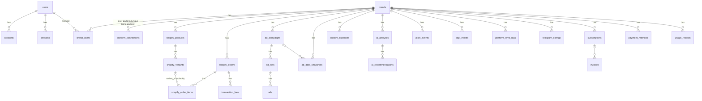

# AutoPost → D2C Profit OS V1: Repository Audit

**Repo:** `D:\D2C-Profit-OS\autopost` · **Audit date:** 26 Sep 2026 · **Mode:** read-only (no code, dependencies, or database changes)
**Git HEAD:** `fbdefae feat: add landing page and fix auth setup` (15 commits, all scaffold-style "feat: add X" commits)

> **Side effect during the audit.** Running `git diff` in the audit sandbox left an empty lock file at `.git/index.lock` (created 11:32) and refreshed `.git/index` (the stat cache only, no content change). The sandbox is not allowed to delete files, so it could not remove the lock. Until it is removed, git commands will fail with "Another git process seems to be running". **Fix:** delete `D:\D2C-Profit-OS\autopost\.git\index.lock`. No working-tree files were changed. (The `M` flags on `.github/*`, `.gitignore` and other files come from CRLF line endings on Windows, not from edits.)

---

## Executive summary

- The repo is a **broad but shallow scaffold**: about 150 source files covering Shopify, Meta, Snapchat, Google Ads, TikTok, AI, CAPI, attribution, Telegram and Polar billing. Almost every module stops at the "happy-path demo" level.
- **Type-check passes** (`tsc --noEmit`: 0 errors). There are **no tests**, and several runtime paths are broken:
  - Every Shopify webhook returns 500.
  - Meta insights are requested with an invalid `time_range`.
  - All scheduled syncs are non-functional.
  - The dashboard can never select a brand.
- **Profit numbers are not trustworthy for an Indian COD business:**
  - Revenue counts only `financial_status = 'paid'`, so COD orders are excluded.
  - COGS is always null.
  - Shipping and RTO are never costed.
  - Fees use US Stripe rates.
  - ROAS is faked as `conversions × $50`.
  - Platform revenue is allocated in proportion to spend.
- **Multiple cross-tenant authorization holes** (IDOR). The worst is `GET /api/dashboard/compare`, which returns any brand's P&L to any logged-in user.
- **Worth reusing:** Next.js 16 + Auth.js + Drizzle + Neon skeleton, `brands`/`brand_users` tenancy model, UI kit, some schema shapes, HMAC and encryption helpers.
- **Must be rebuilt for V1:** Shopify/Meta ingestion, profit engine, attribution, jobs, webhooks.

---

## 1. CURRENT ARCHITECTURE

The app is a single Next.js 16 App Router monolith deployed to Vercel. Pages, API routes and "services" (`src/lib/*`) all live in one app.

```
Browser ──> Next.js pages (RSC + client comps, SWR/fetch)
              │
              ├─> /api/brands/[id]/*   (session auth via Auth.js JWT + hasBrandAccess)
              ├─> /api/dashboard/*     
              ├─> /api/webhooks/shopify, /api/billing/webhook, /api/telegram/webhook (public)
              └─> /api/brands/[id]/pixel-events (public, unauthenticated)
                    │
                    └─> src/lib/* services ──> Drizzle (neon-http driver) ──> Neon Postgres
                                         └──> fetch() to Shopify REST / Meta Graph / Polar / Telegram
Schedulers (declared, not working):
  vercel.json crons ──> /api/cron/* (routes DO NOT EXIST)
  .github/workflows/sync.yml ──> scripts/sync-platform.js (cannot run; see §9)
```

- **Services are synchronous and request-bound.** Every sync runs inside the HTTP request that triggers it (`src/app/api/brands/[id]/sync/route.ts` and `.../sync/shopify/route.ts`). There is no queue, no worker and no retry.
- **Data access is ad hoc.** Each route builds its own Drizzle queries. There is no repository or service boundary and no tenant-scoped DB wrapper.
- **Dead code:** Snapchat, Google Ads and TikTok clients are wired into `src/lib/platforms/ads/sync.ts`. They are out of scope for V1.
- **Documentation drift:**
  - README says Next 15, RLS, Vercel Blob, Gemini/Claude and TanStack Query. The code has Next 16.2.2, no RLS, no Blob, no LLM calls, and SWR in use.
  - `.env.example` does not exist, although README and `scripts/setup.sh` reference it.
  - Env var names disagree between `README.md` (`SHOPIFY_CLIENT_ID`, `AUTH_GOOGLE_ID`) and `DEPLOYMENT.md` (`SHOPIFY_API_KEY`, `GOOGLE_CLIENT_ID`).
- **Agent rules:** `CLAUDE.md` → `@AGENTS.md`. It tells agents to read `node_modules/next/dist/docs/` before writing Next code, because Next 16 has breaking changes. One example: the `middleware` filename is deprecated and renamed `proxy` (confirmed in `node_modules/next/dist/docs/01-app/01-getting-started/16-proxy.md`), yet `src/middleware.ts` still uses the old name.

## 2. TECHNOLOGY STACK

| Layer | Actual (from `package.json` / code) | Notes |
|---|---|---|
| Framework | `next@16.2.2`, `react@19.2.4` | README says 15 |
| Language | TypeScript 5, `strict: true` (`tsconfig.json`) | `tsc --noEmit` = 0 errors |
| ORM | `drizzle-orm@^0.45.2`, `drizzle-kit@^0.31.10` | schema at `src/lib/db/schema/*` |
| DB driver | `@neondatabase/serverless` via `drizzle-orm/neon-http` (`src/lib/db/index.ts`) | **HTTP driver has no interactive transactions**, which V1 needs for idempotent multi-table upserts |
| Auth | `next-auth@5.0.0-beta.30`, Credentials + optional Google, JWT sessions, bcryptjs | no DB adapter wired (though `@auth/drizzle-adapter` is installed) |
| Validation | `zod@^4` | used only for brand and auth forms |
| UI | Tailwind v4, Radix/shadcn-style components (`src/components/ui/*`), `recharts`, `lucide-react` | |
| Data fetching | `swr` (used), `@tanstack/react-query` (installed, unused) | |
| Env validation | `@t3-oss/env-nextjs` installed, **unused** | |
| Payments | Polar.sh via raw fetch (`src/lib/payments/polar.ts`) | |
| Messaging | Telegram raw fetch (`src/lib/telegram/*`) | |
| AI | **No LLM SDK.** `src/lib/ai/analysis.ts` is rule-based z-score and heuristics | |
| Tests | **none** (no runner, no test files) | CI step `npm test --if-present` is a no-op |
| CI/CD | GitHub Actions (`.github/workflows/*`), Vercel (`vercel.json`, region `iad1`) | CI uses Node 20; `.nvmrc` = 24.14.1; audit sandbox = 22 |

## 3. DATABASE / ERD

**Source of truth:** `src/lib/db/schema/*.ts` → single migration `drizzle/0000_rare_sister_grimm.sql` (28 tables).

⚠️ **`drizzle/schema.ts` and `drizzle/relations.ts` are an introspection of a *different* database.** They contain the Next.js "learn dashboard" tutorial tables (`customers`, `invoices`, `revenue`, `users` with `uuid_generate_v4()`). So at some point `DATABASE_URL` pointed at a database holding those tables. `users` and `invoices` collide with this app's tables, so running `db:push` against that database could alter or drop data.



**Schema observations:**

| Issue | Where |
|---|---|
| Child tables have **no `brand_id`**: `shopify_variants`, `shopify_order_items`, `transaction_fees`, `ad_sets`, `ads`. Lookups by platform ID are therefore not tenant-scoped. | `shopify.ts`, `ads.ts` |
| `shopify_variants`: no unique constraint on `(product_id, shopify_variant_id)`, so duplicates are possible | `shopify.ts` |
| `shopify_order_items`: no unique constraint on `shopify_line_item_id`; `quantity` is **text**; no `sku`, no discount allocation | `shopify.ts` |
| `shopify_orders`: missing COD/partial-COD fields, `payment_gateway_names[]` (only the first is kept), `tags`, `landing_site`/`referring_site`/UTMs, `currency`, cancel reason, delivery status, `shopify_updated_at` (needed for ordering/idempotency) | `shopify.ts` |
| `ad_data_snapshots` unique constraint is `(brand_id, platform, ad_id, date)`, but sync inserts **`ad_id = NULL`** (campaign level). Postgres treats NULLs as distinct, so every sync inserts new rows and spend is double-counted. | `ads.ts`, `platforms/ads/sync.ts:204` |
| `ad_sets`/`ads`: no unique constraint; `ads.campaign_id` is never set for Meta | `ads.ts`, `ads/sync.ts:181` |
| No ad-account dimension: `platform_connections` is unique on `(brand, platform)`, so each brand gets **one Meta ad account and one Shopify store** | `platforms.ts` |
| Money columns are `decimal(10,2)` (max about 99,999,999.99), and some money is stored as **`varchar`** (`brands.default_cogs_percentage`, `subscriptions.amount`, `invoices.total`, `usage_records.quantity`) | `core.ts`, `payments.ts` |
| Dates are stored as `text` (`ad_data_snapshots.date`, `custom_expenses.start_date`) | `ads.ts`, `financial.ts` |
| `brand_users` has **no primary key or unique constraint**, so duplicate memberships are possible | `core.ts` |
| `notification_preferences` / `notification_logs` have no foreign keys | `notifications.ts` |
| No `webhook_events`, `jobs`, `audit_logs`, `cost_rules`, `sku_costs`, `shipments`, `refunds` or `attribution` tables | — |
| No RLS policies in the migration, despite the README's claims | `drizzle/0000_*.sql` |
| `pixel_events` has no unique constraint on `event_id` (no dedupe) | `attribution.ts` |

## 4. EXISTING SHOPIFY FEATURES

| Feature | Status | Evidence |
|---|---|---|
| Connect store | **Manual:** paste `storeDomain` + Admin API access token. Validated via `/shop.json`. No OAuth install flow and no scopes check. | `src/app/api/brands/[id]/connections/shopify/route.ts` |
| Token storage | **Plaintext** in `platform_connections.access_token` | same |
| API client | REST Admin API pinned to **`2024-01`**, no pagination (Link header ignored), no rate-limit/429 handling, no retries | `src/lib/platforms/shopify/client.ts:81` |
| Product sync | First 250 **active** products only, sequential N+1 queries. Variant lookup is **not brand-scoped**. `inventory_item.cost` is not returned by the products endpoint, so **COGS is always null**. | `src/lib/platforms/shopify/sync.ts:30-131` |
| Order sync | First 250 orders (`status=any`), N+1. On create it stores totals, line items, a fee estimate and refunds. **Updates touch only `financial_status`/`fulfillment_status`**, so edits, refunds, cancellations and line changes after the first import are lost. COGS relies on `line_items[].variant.inventory_item.cost`, which does not exist in the REST order payload. | `sync.ts:133-259` |
| Webhooks | See §8. Route exists but is broken. **No code registers webhooks** with Shopify. | `src/lib/platforms/shopify/webhooks.ts` |
| Fees | Hardcoded US rates (2.9% + $0.30) applied to *every* gateway, including COD | `client.ts:178-198` |
| PII | Email is SHA-256 hashed (`hashEmail`). No phone or pincode stored (pincode is needed for RTO analysis). | `client.ts:200` |
| Delivery / RTO / COD / partial COD | **Not modelled** | — |

**Platform note (verify before build):** the REST Admin API is legacy. Shopify has required GraphQL Admin for new public apps since 2025, and API version `2024-01` is well past its support window. V1 should use GraphQL Admin (with Bulk Operations for backfill).

## 5. EXISTING META FEATURES

| Feature | Status | Evidence |
|---|---|---|
| Connect | Paste long-lived user or system token + `accountId`. Checked against `/me/adaccounts`. Token stored in plaintext. No token-expiry tracking or refresh. | `src/app/api/brands/[id]/connections/meta/route.ts` |
| UI to connect | `AdPlatformConnections` component exists but is **not mounted on any page** | `src/components/dashboard/ad-platform-connections.tsx` (grep: no importers) |
| API version | Graph **`v19.0`** hardcoded (CAPI uses `v18.0`). Both are likely deprecated by now; confirm the current version. | `src/lib/platforms/meta/client.ts:67`, `src/lib/capi/meta.ts:201` |
| Entity sync | Campaigns → ad sets → ads walked with 1 + N + N×M requests and **no paging** (only the first 25 of each). Ad set and ad lookups are **not brand-scoped**. Ad set/ad names and statuses are never updated after the first insert. | `src/lib/platforms/ads/sync.ts:96-235` |
| Insights | **Campaign level only**. `time_range` sent as `since_X_until_Y` instead of the required JSON `{"since":"…","until":"…"}`, so the request should fail. The error is swallowed as "non-fatal" (`sync.ts:220`). Uses deprecated param `attribution_windows` instead of `action_attribution_windows`. | `meta/client.ts:133-152` |
| Metrics captured | spend, impressions, clicks, `offsite_conversion.fb_pixel_purchase` count. **No purchase value** (`action_values`), so `revenue_reported` is always 0. `spend` is typed as a number but Meta returns strings. | `meta/client.ts:155-161`, `ads/sync.ts:204-216` |
| Restatement | `onConflictDoNothing` means late Meta revisions are never applied (and with a NULL `ad_id` the conflict never fires anyway) | `ads/sync.ts:216` |
| Date / timezone | Syncs "today" in **UTC** by default. Ad account timezone is ignored. | `sync/route.ts:74` |
| CAPI | Sends events using the brand's Meta token. `user_data` keys are camelCase (`email`, `phone`) instead of Meta's `em`, `ph`. `getMetaConfig` picks the first connection of **any** platform. | `src/lib/capi/meta.ts:74-96, 184-197` |

## 6. EXISTING PROFIT ENGINE

**File:** `src/lib/profit/calculations.ts`. It is exposed via `GET /api/brands/[id]/profit` and consumed by the dashboard overview, AI, and compare.

**Formula implemented:**
```
revenue      = Σ total_price − Σ refund_amount      (orders WHERE financial_status='paid', processed_at::date in range [UTC])
cogs         = Σ order_items.total_cost             (always ~0; see §4)
fees         = Σ transaction_fees.fee_amount        (US Stripe estimate)
adSpend      = Σ ad_data_snapshots.spend            (all platforms)
customExp    = prorated custom_expenses
grossProfit  = revenue − cogs − fees
netProfit    = revenue − cogs − fees − adSpend − customExp
roas         = revenue / adSpend   (blended)
```

- **Not implemented:** forward shipping cost, RTO cost, COD fee, GST removal, delivery-based realization, order-level profit, product-level profit, campaign-level profit.
- README (`README.md`, "Profit Calculation Formula") claims shipping is deducted; the code does not deduct it.
- **Daily, weekly and monthly series** run the full 5-query calculation **once per day in range**, in parallel (30 days ≈ 150+ queries per request), then re-aggregate in JS.
- `getPlatformProfitBreakdown` **allocates total revenue across platforms in proportion to spend** (lines 411-421), so every platform shows the same ROAS. This is fabricated attribution.
- Dashboard "top campaigns" and AI recommendations compute ROAS as `conversions × 50 / spend` (`src/lib/dashboard/overview.ts:139`, `src/lib/ai/analysis.ts:~431`).

See §19 for the full list of calculation risks.

## 7. EXISTING DASHBOARD

| Page | Path | State |
|---|---|---|
| Landing | `src/app/page.tsx` | marketing page |
| Login / Register | `src/app/(auth)/login`, `register` | work (Credentials). Register is an inline server action. |
| Dashboard overview | `src/app/(dashboard)/dashboard/page.tsx` + `dashboard-overview-client.tsx` | **Cannot show data.** Brand is read from the `currentBrandId` cookie, which **no code ever sets** (grep). The brand cards link to `?brandId=` instead, which the page ignores. The server-side `fetch` to its own `/api/dashboard/.../overview` forwards no cookies, so it gets 401. |
| Profit | `dashboard/profit/*` | Same cookie issue. Charts (`recharts`) exist. `$` hardcoded. |
| Brand detail | `dashboard/brands/[id]/page.tsx` | Revenue, Ad Spend and Profit cards are **hardcoded `$0.00`** (lines 63-92) |
| Brand settings | `dashboard/brands/[id]/settings/page.tsx` | Shopify connect + manual sync UI (`components/dashboard/shopify-connection.tsx`) |
| AI, Attribution, Billing, Notifications | `dashboard/{ai,attribution,billing,notifications}` | Present, all cookie-dependent. Attribution numbers are meaningless (§19). |

Missing for V1: order explorer, product/SKU table, campaign/ad-set/ad table, cost configuration, Google Sheets setup, sync status, system health, audit log, currency/timezone-aware formatting.

## 8. EXISTING WEBHOOKS

| Endpoint | Auth | Problems |
|---|---|---|
| `POST /api/webhooks/shopify` (`src/app/api/webhooks/shopify/route.ts`, `src/lib/platforms/shopify/webhooks.ts`) | HMAC-SHA256 with global `SHOPIFY_WEBHOOK_SECRET` | (1) **Body is consumed twice.** `verifyShopifyWebhook` calls `request.text()` and the route then calls `req.json()`, which throws, so **every webhook returns 500**; Shopify retries, then eventually removes the subscription. (2) `timingSafeEqual` throws on length mismatch, so a bad HMAC gives 500 instead of 401. (3) No `X-Shopify-Webhook-Id` dedupe, no event log. (4) Processing is inline; Shopify expects a response within about 5 s. (5) `refunds/create` looks up the order **without brand scope** and **adds** to `refund_amount`, so retries double-count. (6) `orders/updated` only updates two status fields. (7) No handlers for `fulfillments/*`, `orders/edited`, `products/*`, `inventory_items/update` (cost changes). (8) GDPR mandatory topics are not handled. |
| `POST /api/billing/webhook` (Polar) | HMAC hex compare | Verification is **skipped entirely if `POLAR_WEBHOOK_SECRET` is unset** (line 17). Non-constant-time compare. Scheme may not match Polar's (Standard Webhooks headers). Inserts with `brandId: ""` when metadata is missing, which fails the FK. |
| `POST /api/telegram/webhook` | Secret-token header, **only enforced when `NODE_ENV=production`** | Out of V1 scope |
| `POST /api/brands/[id]/pixel-events` | **None.** `brandId` is taken from the body, not the URL. | Anyone can write events to any brand. No rate limit or dedupe. |

## 9. EXISTING BACKGROUND JOBS

**Effectively none work:**

1. **`vercel.json` crons** hit `/api/cron/daily-summary`, `/api/cron/weekly-summary` and `/api/cron/check-anomalies`, but **none of these routes exist** (no `src/app/api/cron/`), so they return 404. `CRON_SECRET` is documented but checked nowhere.
2. **`.github/workflows/sync.yml`** (every 30 min) runs `node scripts/sync-platform.js`, which cannot work:
   - It `require`s `"@/lib/db"`, a TS path alias that plain Node cannot resolve (and the files are TS/ESM).
   - It calls `/api/brands/:id/sync` with `Authorization: Bearer CRON_SECRET`, but that route only accepts an Auth.js session, so it returns 401.
   - For Shopify it posts `{platform:"shopify"}`, which the route rejects ("Invalid platform").
3. `checkAndTriggerAlerts` is a stub (`src/lib/telegram/notifications.ts:360`).
4. **Sync logging:** `logSync` inserts a new "started" row and then a separate "success" row. `updateSyncLog` exists but the ads route never uses it. Failures from inside `syncAdData` are swallowed and counted as `errors`.

No queue, retries, backoff, dead-letter, concurrency control, per-tenant locking or cursors/checkpoints.

## 10. EXISTING AUTHENTICATION

- **Setup:** Auth.js v5, JWT strategy (`src/lib/auth/auth.ts`). Credentials provider (bcrypt cost 12, `src/lib/auth/password.ts`). Optional Google OAuth (`src/lib/auth/providers.ts`) with `allowDangerousEmailAccountLinking: true`.
- **Google OAuth bug:** there is no DB adapter. For a first-time Google user, `signIn` inserts a row, but `token.id` is set from the provider `user.id`, not the new DB UUID (`auth.ts:64-67, 88-95`). Their `session.user.id` then never matches `brand_users.user_id`, so Google sign-up users cannot access brands.
- **Route protection:** `src/middleware.ts` only guards `/dashboard*`. APIs guard themselves per route.
- **Missing:** email verification, password reset, login rate limiting, account lockout, 2FA.
- **Unused tables:** `accounts`/`sessions` exist but nothing uses them with JWT sessions.

## 11. EXISTING MULTI-TENANT SUPPORT

- **Tenant = `brands`**, membership = `brand_users(role: owner|manager|viewer)`. Access helper: `hasBrandAccess(userId, brandId)` (`src/lib/auth/brand-auth.ts`).
- **Isolation is application-level only.** There is no RLS and no tenant-scoped query layer. Every route must remember to check.

**Authorization bugs:**

| Route | Bug |
|---|---|
| `GET /api/dashboard/compare` (`src/app/api/dashboard/compare/route.ts`) | **No brand access check.** Any logged-in user can pass any `brandIds` and get full profit metrics. |
| `POST /api/brands/[id]/capi/send` | Checks `role === "viewer"` only. **Non-members (`null`) pass** and can send CAPI events using another brand's Meta token. |
| `PUT/DELETE /api/brands/[id]/notifications`, `POST .../notifications/test` | Same `=== "viewer"` pattern. Also mass-assignment (`...body` into the update). |
| `POST /api/brands/[id]/billing/checkout` | Same pattern |
| `DELETE /api/brands/[id]/billing/subscription` | Same pattern, **and** `cancelSubscription(subscriptionId)` is not scoped by brand (`src/lib/payments/management.ts:233`). Any user can cancel any subscription by ID. |
| `POST /api/brands/[id]/pixel-events` | Unauthenticated; brandId from body |
| `GET /api/brands/[id]/connections/google` | Returns `metadata` containing **`clientSecret` and `developerToken`** to any member, including viewers |

**Cross-tenant data mixing in sync code:**
- Variant lookup by `shopifyVariantId` without brand (`shopify/sync.ts:67, 203`; `webhooks.ts:149`).
- Refund webhook order lookup without brand (`webhooks.ts:191`).
- Ad set and ad lookups by platform ID without brand (`ads/sync.ts:152, 176`).

Two tenants syncing the same test store or ad account would corrupt each other's rows.

**Limits:**
- One Shopify store and one Meta ad account per brand (unique `(brand, platform)`).
- There is no "organization/agency" level above brands. Your agency use case (many client brands per operator) works only through many `brand_users` rows.

## 12. WHAT ALREADY MATCHES OUR V1

- A tenant (brand) + role membership model, and a per-route access helper (`src/lib/auth/brand-auth.ts`).
- Credentials auth with bcrypt; JWT sessions; login/register pages.
- Brand settings with `timezone`, `currency`, `default_cogs_percentage` (`src/lib/db/schema/core.ts`). The fields exist but are not used in calculations.
- Shopify and Meta connections stored per brand (`platform_connections`), with a UI to connect Shopify.
- Basic schema shapes for products/variants/orders/items and campaigns/ad sets/ads/daily snapshots.
- `custom_expenses` with frequency proration: a starting point for "other configurable costs".
- `platform_sync_logs`: a starting point for sync status.
- Shopify HMAC helper and email hashing (`shopify/client.ts:166-205`); AES-256-GCM helper (`src/lib/utils/encryption.ts`, currently unused).
- UI component kit and a Recharts chart component (`components/ui/*`, `components/dashboard/profit-chart.tsx`).

## 13. WHAT IS PARTIALLY IMPLEMENTED

| V1 area | What exists | Gap |
|---|---|---|
| Revenue, orders | Aggregations in `calculations.ts` | Paid-only, UTC, gross of tax, refunds/COGS inconsistent |
| Ad spend | Snapshot table + Meta sync | Broken request, duplicate rows, campaign-level only |
| Product COGS | `cost_per_item` columns | Never populated; no manual/Sheets override; not effective-dated |
| Payment gateway fees | `transaction_fees` table | Wrong rates, applied to COD, per-gateway on full total |
| Order status / fulfillment | `financial_status`, `fulfillment_status` | Only on create; no delivery/RTO |
| Refunds | `refund_amount` aggregate | Non-idempotent; not line-level; no COGS reversal |
| Webhooks | Route + handlers | Broken (body reuse), no dedupe, no queue |
| Sync status | `platform_sync_logs`, `lastSyncedAt` | Not surfaced in UI; logs not updated correctly |
| Campaign table | `topCampaigns` in overview | Top 5 by spend; fake ROAS |
| Attribution | Models in `attribution/tracking.ts` | Not connected to orders; sums pixel event values |
| Dashboard | Pages + charts | Brand selection broken; hardcoded values |

## 14. WHAT IS MISSING

**Integrations**
- Google Sheets: nothing at all (no client, schema or UI).
- Shopify OAuth install, webhook registration, GraphQL, pagination/backfill, fulfillment events.
- Meta ad-level insights with `action_values`, pagination, rate-limit handling, account timezone/currency, token health.

**Commerce model**
- COD / prepaid / partial-COD classification.
- Delivery status, RTO, NDR, shipments table.
- Forward and RTO shipping cost rules.
- COD fee rules.
- GST handling.
- Line-level refunds.
- Effective-dated SKU costs.

**Profit**
- Order-level, product-level and campaign-level profit.
- Estimated vs realized profit, and profit at risk.
- Calculation versioning.

**Attribution**
- UTM/ad-ID capture on orders.
- Attribution link table with method + confidence.
- Coverage metrics.
- Explicit methodology labels.

**Reliability**
- Job runner, retries, idempotency keys, webhook event store.
- Reconciliation jobs, sync cursors, system health page, audit logs.

**Quality**
- Tests of any kind.
- `.env.example`, env validation.
- Error monitoring.

## 15. WHAT SHOULD BE REUSED

- **Stack:** Next.js 16 App Router, Drizzle, Neon, Auth.js (Credentials), Tailwind + component kit (`src/components/ui/*`).
- **Tenancy:** `brands` + `brand_users` concept and roles, after adding a primary key and wrapping in a single guard.
- **Utilities:** `src/lib/utils/encryption.ts` (AES-GCM; add key versioning), `hashEmail`, `verifyWebhookHMAC` (after the length-safe fix), `slug.ts`, `cn.ts`.
- **Schema naming and table shapes** for products, variants, orders, items, campaigns, ad sets and ads, as a base for v2 migrations.
- **Auth pages, dashboard layout shell, brand switcher, chart component.**
- **CI skeleton** (lint, type-check, build), after aligning the Node version.

## 16. WHAT SHOULD BE REFACTORED

| Module | Refactor |
|---|---|
| Authorization | Single `requireBrandRole(brandId, minRole)` guard used by every route. Remove the `=== "viewer"` pattern. Add a tenant-scoped query helper. |
| DB driver | Add a pooled/WebSocket Neon driver (`drizzle-orm/neon-serverless` or `node-postgres`) for transactional writes. Keep HTTP for reads if desired. |
| Shopify client | Rewrite on GraphQL Admin (current stable version), cost-based throttling, Bulk Operations for backfill, idempotent upserts keyed on `(brand_id, shopify_id)`. |
| Meta client | Paged, ad-level insights with a correct `time_range` and `action_values`; rolling restatement window; account timezone. |
| Profit engine | Rewrite as **pure functions** (no DB) over a normalized order model + cost config, persisted to `order_profit` with `calc_version`. Aggregations in SQL, bucketed in the brand's timezone. |
| Webhook route | Raw body read once → verify → persist event → enqueue → 200. |
| Sync orchestration | Move to a job runner; sync logs become `sync_runs` with cursor/checkpoint. |
| Dashboard data flow | Brand from the URL segment (`/dashboard/[brandId]/…`) instead of an unset cookie; call services directly in RSC (no self-HTTP fetch); currency formatting from the brand. |
| Middleware | Rename to `proxy.ts` per Next 16 docs. |
| Config | `@t3-oss/env-nextjs` schema + `.env.example`. |

## 17. WHAT SHOULD NOT BE TOUCHED

- **The existing migration `drizzle/0000_rare_sister_grimm.sql` and `drizzle/meta/*`.** Evolve with new generated migrations; never edit applied ones.
- **Any live database behind the current `DATABASE_URL`.** It appears to hold unrelated tutorial tables (see `drizzle/schema.ts`). Use a fresh Neon project or branch for V1, and never run `db:push` or the `db-migrate.yml` "drop" option against production.
- **Snapchat, Google Ads and TikTok code, Polar billing, Telegram, AI and CAPI.** Leave them in place but out of V1 scope (feature-flag or unlink from navigation). Don't spend effort fixing them now, except for the security issues in §18 that are reachable today.
- **`AGENTS.md` / `CLAUDE.md` rules.** Keep them. Follow the Next 16 docs in `node_modules/next/dist/docs/`.
- **`package-lock.json` / dependency versions** until a deliberate upgrade PR.

## 18. SECURITY RISKS

Ordered by severity:

1. **Cross-tenant P&L disclosure:** `src/app/api/dashboard/compare/route.ts` has no membership check.
2. **Non-member write access** via the `role === "viewer"` checks:
   - `capi/send` (send events with another brand's token)
   - `notifications` PUT/DELETE/test
   - `billing/checkout`
   - `billing/subscription` DELETE, combined with the unscoped `cancelSubscription` (`src/lib/payments/management.ts:233`)
3. **Secrets in plaintext:** Shopify/Meta access tokens, Google refresh token, client secret and developer token (`platform_connections`). `encryption.ts` is never called (grep: 0 usages).
4. **Secret leakage in API responses:** Google connection `GET` returns `metadata.clientSecret`/`developerToken`. Meta/Shopify `GET` return `metadata` (could hold `webhookSecret`).
5. **Unauthenticated write endpoint:** `pixel-events` (brandId from body; no rate limit). This allows storage abuse and attribution poisoning.
6. **Wildcard CORS** on all `/api/*` (`vercel.json` headers).
7. **Webhook verification weaknesses:** Polar verification skipped when the env var is missing; Telegram check skipped outside production; Shopify `timingSafeEqual` length throw.
8. **Cross-tenant row mixing** in sync/webhook lookups without `brand_id` (§11).
9. **OAuth account linking:** `allowDangerousEmailAccountLinking: true` plus the wrong `token.id` for new OAuth users.
10. **Mass assignment:** `notifications` PUT spreads the request body into the DB update.
11. **Error detail leakage:** `details: error.message` returned from several routes (`profit`, `sync`, `ai`, `capi/send`).
12. **No auth rate limiting or lockout; no email verification.**
13. **Operational:**
    - `db-migrate.yml` exposes a "drop" choice against the production environment (also calls a nonexistent `db:drop`).
    - `deploy.yml` runs `db:generate` with production secrets and duplicates the `NEXT_PUBLIC_APP_URL` key.
    - `drizzle/schema.ts` suggests the DB URL once pointed at a different database.
14. **PII:** phone numbers and addresses aren't stored yet. V1 will need them for COD/RTO analysis, so plan for encryption at rest, retention, and the Shopify GDPR webhooks (`customers/data_request`, `customers/redact`, `shop/redact`).

## 19. DATA / PROFIT CALCULATION RISKS

| # | Risk | Evidence | Impact for an Indian COD brand |
|---|---|---|---|
| 1 | Revenue = `financial_status='paid'` only | `calculations.ts:73, 93, 111`; `overview.ts:79` | COD orders sit in `pending` until remittance, so **most revenue and orders are missing**; partially-paid (partial COD) orders are also excluded |
| 2 | `total_price` includes GST and shipping charged | `calculations.ts:63` | Revenue overstated by GST (5–18% on footwear) |
| 3 | COGS always null → 0 | §4; `default_cogs_percentage` unused | Profit overstated by the full COGS |
| 4 | No forward shipping or RTO cost | — | For COD footwear these are often the largest variable costs |
| 5 | Fees at 2.9% + $0.30 on every gateway, including COD, and on the full total once per gateway | `client.ts:178-198`, `sync.ts:183-195` | Wrong fees; $0.30 applied to INR amounts |
| 6 | Refunds: created once on import, then added again by webhook; retries add again; COGS not reversed | `sync.ts:221-235`, `webhooks.ts:189-212` | Double-counted refunds |
| 7 | Ad spend: duplicate rows (NULL `ad_id` in the unique key) **or** zero rows (invalid `time_range`) | `ads/sync.ts:195-216`; `meta/client.ts:144` | Spend either 0 or multiplied by the number of syncs |
| 8 | Days bucketed in **UTC** (`processed_at::date`, `toISOString()`) | `calculations.ts:71`, `overview.ts:68` | IST day boundary off by 5.5 h; orders and spend land on the wrong day |
| 9 | Fake ROAS: `conversions × 50` | `overview.ts:139`, `ai/analysis.ts` | Meaningless campaign ranking and "kill/scale" advice |
| 10 | Platform revenue allocated in proportion to spend | `calculations.ts:411-421` | Fabricated attribution; **violates the V1 accounting rule** |
| 11 | "Attribution" sums the `value` of **all** pixel events (any type) in range | `attribution/tracking.ts:360-390` | Fabricated revenue by campaign |
| 12 | Only the first 250 orders/products synced; no backfill | `shopify/sync.ts:41, 145` | Silent truncation |
| 13 | Order edits, cancellations and fulfillment changes never re-imported | `sync.ts:236-247` | Stale statuses and amounts |
| 14 | Custom expense proration uses the full query range, not the overlap; `monthly` = days / 30.44 | `calculations.ts:144-177` | Over/under-allocation near expense start/end |
| 15 | JS floats for money; `decimal(10,2)`; varchar money | throughout | Rounding drift; overflow at scale |
| 16 | Currency ignored; `$` hardcoded in UI | `overview.ts:166`, pages | Wrong symbol for INR brands; multi-currency stores break |
| 17 | N×5 queries per daily series | `calculations.ts:227` | Timeouts on 90-day ranges |

**Attribution truth for V1 (must be stated in the product):**

- **Meta gives:** exact spend per campaign, ad set, ad and day, plus *Meta-modelled* purchases and purchase value under its own attribution window (pixel/CAPI, default 7-day click / 1-day view, includes modelled conversions).
- **Shopify gives:** per order, `landingSite`/`referringSite` and UTM parameters (and `fbclid`) *when present*, via REST `landing_site` or GraphQL `customerJourneySummary`.
- **The only deterministic order→ad link** is a UTM that carries Meta IDs. Recommend the Meta URL parameter template `utm_source=facebook&utm_medium=paid&utm_campaign={{campaign.id}}&utm_term={{adset.id}}&utm_content={{ad.id}}`. It still misses:
  - in-app browser sessions that lose parameters
  - view-through purchases
  - multi-session purchases
- **V1 should therefore show three explicitly labelled numbers per campaign, and never add them together:**
  1. **Meta-reported:** Meta's attribution.
  2. **UTM-matched:** deterministic, from Shopify orders.
  3. **Unattributed remainder** at brand level.
- Campaign-level contribution and realized profit should be computed only on UTM-matched orders, with a visible "attribution coverage %" (matched orders ÷ total orders).

## 20. PROPOSED V1 ARCHITECTURE

```
                ┌───────────────────────── Next.js 16 (Vercel, region near Neon, e.g. bom1 + aws-ap-south-1) ─────────────────────────┐
 Shopify ──webhooks──> /api/webhooks/shopify ──verify HMAC(raw body)──> INSERT webhook_events (unique webhook_id) ──> enqueue ──> 200
 Meta    <──pull──┐                                                                                                        │
 Sheets  <──pull──┤                    Job runner (Inngest / Trigger.dev / QStash; retries, backoff, per-brand concurrency)  │
                  │   ┌─ shopify.order.upsert (refetch order by GID via GraphQL → idempotent upsert, compare updatedAt) <───┘
                  │   ├─ shopify.backfill (Bulk Operation → JSONL → batched upserts, cursor in sync_runs)
                  ├───├─ meta.insights.sync (per ad account, level=ad, daily, rolling 7–28-day restatement, upsert on unique key)
                  │   ├─ meta.entities.sync (campaigns/adsets/ads, paged)
                  └───├─ sheets.import (COGS / shipping rate card / courier delivery+RTO status; validated, versioned)
                      ├─ profit.recompute (order-level, pure engine, writes order_profit with calc_version; triggered by any input change)
                      ├─ attribution.link (parse UTMs/fbclid → attribution_links with method+confidence)
                      ├─ rollups (daily_brand_metrics, daily_sku_metrics, daily_ad_metrics in brand timezone)
                      └─ reconcile.nightly (Shopify order count/sum per day vs DB; Meta account-level spend vs Σ ad-level; drift → alert)
 UI (RSC, /dashboard/[brandId]/…) ──> service layer (requireBrandRole + tenant-scoped repos) ──> rollups + order_profit
 Observability: Sentry, structured logs, sync_runs + webhook_events status → System Health page; audit_logs for config/cost changes
```

**Key design rules:**

1. **Inputs vs derived.** Raw platform data (orders, lines, fulfillments, refunds, insights) is stored separately from **derived** data (`order_profit`, rollups). Derived data is always recomputable.
2. **Idempotency everywhere:**
   - unique natural keys (`brand_id` + platform ID)
   - `webhook_events.webhook_id` unique
   - upserts guarded by `source_updated_at`
3. **Costs are effective-dated rules.** Changing a cost creates a new version and triggers recompute; history stays explainable.
4. **Two profit states per order:**
   - **Estimated** (at order time, using expected delivery/RTO rates)
   - **Realized** (once terminal: delivered/RTO/cancelled/refunded)
   - **Profit at risk** = estimated contribution of non-terminal COD and partial-COD orders.
5. **Money** in `numeric(14,2)` + currency code. Compute in integer paise or a decimal library; never JS floats.
6. **Timezone:** all reporting days are computed in `brands.timezone` (Asia/Kolkata); Meta insights are stored in the ad account's timezone, with that timezone recorded.

**Proposed V1 metric definitions (to confirm):**

- **Net revenue** = Σ line price×qty − line discounts − GST (configurable: include shipping charged).
- **Variable cost** = COGS(qty, effective-dated) + forward shipping + gateway fee (prepaid portion) + COD fee (COD portion) + other per-order/per-unit costs.
- **Estimated order contribution** = p_deliver × (net revenue − COGS − COD fee) − forward ship − (1 − p_deliver) × RTO ship − gateway fee.
  - `p_deliver` = brand default, later by pincode/payment mode.
  - Prepaid orders use p_deliver ≈ 1 unless cancelled.
- **Realized order contribution:**
  - delivered: net revenue − refunds − COGS − all fees − ship
  - RTO: −(forward ship + RTO ship + restock/damage %)
  - cancelled pre-ship: 0 (or a configured cost)
- **Business contribution profit** = Σ order contribution − ad spend. **Estimated profit** / **realized profit** = the same, using the estimated / realized order values. **Profit at risk** = Σ estimated contribution of open COD / partial-COD orders.
- **Product level:** line-level allocation of revenue, COGS, fees and shipping (shipping by line weight or unit share).
- **Campaign level:** spend exact. Orders, revenue and contribution **only via UTM-matched orders**, shown next to Meta-reported values, with coverage %.

## 21. PROPOSED DATABASE CHANGES

These are new migrations (generated with `drizzle-kit generate` and applied with `drizzle-kit migrate`, never `push` in production).

**Tenancy and security**
- `brand_users`: composite PK `(brand_id, user_id)`.
- Optional `organizations` table + `brands.organization_id` for the agency use case.
- `audit_logs(id, brand_id, actor_user_id, action, entity, entity_id, before jsonb, after jsonb, ip, created_at)`.
- Encrypt token columns (`*_enc`, `key_version`).

**Connections**
- `platform_connections`: drop unique `(brand, platform)` → unique `(brand, platform, account_id)`.
- Add `status_reason`, `token_expires_at`, `scopes_granted`, `last_error_at`, `api_version`.
- Tables: `shopify_stores` (domain, timezone, currency, installed_at), `meta_ad_accounts` (act id, timezone, currency).

**Shopify raw**
- **`orders` (v2):**
  - identity: `brand_id`, `store_id`, `shopify_order_id` unique per brand, `name`, `source_updated_at`, `processed_at`, `cancelled_at`, `cancel_reason`, `currency`
  - amounts: `subtotal`, `discounts`, `tax`, `shipping_charged`, `total`, `outstanding`, `total_received`
  - payment: `payment_gateway_names text[]`, **`payment_mode` enum (prepaid | cod | partial_cod)**, `prepaid_amount`, `cod_amount`
  - status: `financial_status`, `fulfillment_status`, **`delivery_status` enum**, `is_rto`
  - attribution inputs: `tags text[]`, `landing_site`, `referring_site`, `utm_source/medium/campaign/content/term`, `fbclid`
  - customer: `customer_hash`, `shipping_pincode`, `shipping_state`
  - `raw jsonb`
- **`order_lines`:** `brand_id`, `order_id`, `shopify_line_id` unique, `variant_id`, `sku`, `qty int`, `unit_price`, `discount_allocated`, `tax`, `requires_shipping`, `grams`.
- **`fulfillments` / `shipments`:** `brand_id`, `order_id`, `shopify_fulfillment_id`, `tracking_company`, `tracking_number`, `shipment_status`, `delivered_at`, `rto_initiated_at`, `rto_delivered_at`, `source` (shopify | sheet | courier).
- **`refunds` + `refund_lines`:** `shopify_refund_id` unique, amounts, `restock`.
- **`products`/`variants`:** add `brand_id` to variants; unique `(brand_id, shopify_variant_id)`; `sku`, `grams`, `inventory_item_id`, `shopify_unit_cost`.

**Costs**
- `sku_costs(brand_id, sku|variant_id, cogs, effective_from, effective_to, source, source_ref)`.
- `cost_rules(brand_id, type enum[forward_shipping, rto_shipping, gateway_fee, cod_fee, packaging, other], basis enum[per_order, per_unit, pct_of_revenue, pct_of_cod, weight_slab, zone], params jsonb, payment_mode filter, effective_from/to, version)`.
- `brand_settings`: `expected_delivery_rate_cod`, `expected_delivery_rate_prepaid`, `gst_inclusive_prices bool`, `include_shipping_in_revenue bool`.

**Google Sheets**
- `sheet_sources(brand_id, spreadsheet_id, range, kind enum[cogs, shipping_rates, delivery_status, other_costs], column_map jsonb, schedule, last_imported_at)`.
- `sheet_import_runs(id, source_id, status, rows_read, rows_applied, rows_rejected, errors jsonb, checksum)`.

**Meta**
- `ad_campaigns`/`ad_sets`/`ads`: add `brand_id` + `ad_account_id` to all; unique `(brand_id, platform_id)`; keep names/status updated.
- **`ad_insights_daily`:**
  - key: `brand_id`, `ad_account_id`, `date` (account timezone), `level='ad'`, `campaign_id`, `adset_id`, `ad_id` (NOT NULL); **unique `(ad_account_id, ad_id, date)`**
  - metrics: `spend`, `impressions`, `clicks`, `meta_purchases`, `meta_purchase_value`, `attribution_setting`
  - `fetched_at`, `currency`
  - replaces `ad_data_snapshots`

**Derived**
- `order_profit(order_id PK, brand_id, calc_version, state enum[estimated, realized], net_revenue, cogs, forward_ship, rto_ship, gateway_fee, cod_fee, other_cost, contribution, p_deliver, computed_at, inputs_hash)`.
- `order_line_profit` (for product level).
- `attribution_links(order_id, brand_id, method enum[utm_ad_id, utm_campaign_id, fbclid_only, none], campaign_id, adset_id, ad_id, confidence, created_at)`.
- Rollups: `daily_brand_metrics`, `daily_sku_metrics`, `daily_ad_metrics` (brand-timezone date, materialized by jobs).

**Reliability**
- `webhook_events(id, brand_id, topic, shopify_webhook_id unique, received_at, hmac_ok, payload jsonb, status enum[received, processing, done, failed, skipped], attempts, last_error, processed_at)`.
- `sync_runs(id, brand_id, source, kind[backfill, incremental, restatement, reconcile], status, cursor jsonb, started_at, finished_at, records, error)` (replaces `platform_sync_logs`).
- `reconciliation_results(brand_id, date, source, metric, expected, actual, diff, status)`.
- `job_dead_letters` (if the runner doesn't provide one).

**Indexes:** `(brand_id, processed_at)`, `(brand_id, payment_mode, delivery_status)`, `(brand_id, utm_content)`, `(brand_id, date)` on rollups/insights.

## 22. V1 IMPLEMENTATION PHASES

| Phase | Scope | Exit criteria |
|---|---|---|
| **0. Stabilize & secure** | `requireBrandRole` guard on every route; fix compare/viewer IDORs; encrypt tokens; remove wildcard CORS; hide secrets in GETs; env schema + `.env.example`; Vitest + CI test job; Node version alignment; new clean Neon DB/branch; unlink out-of-scope nav | Route authorization test matrix green; no plaintext secrets |
| **1. Schema v2** | Migrations from §21 (additive; keep old tables until cut-over); transactional DB driver | Migrations apply on a clean DB + rollback plan |
| **2. Shopify ingestion** | OAuth/custom-app install; webhook registration; webhook receiver → `webhook_events` → job; GraphQL refetch + idempotent upsert; Bulk Operations backfill; payment-mode classifier (COD / prepaid / partial COD by gateway names + amounts + tags); fulfillment/refund handling | Replaying the same webhook N times = one state; backfill of 60+ days matches Shopify totals |
| **3. Costs + Google Sheets** | Cost-rule engine + UI; SKU COGS; Sheets service-account import (COGS, rate cards, delivery/RTO status) with validation, preview, import-run logs; audit logs on cost changes | Cost change creates a version, triggers recompute, and is visible in the audit log |
| **4. Meta ingestion** | Ad accounts; entities (paged); ad-level daily insights with `action_values`; restatement window; token health | Σ ad-level spend = account-level spend per day (±0.5%) |
| **5. Profit engine** | Pure calculation library + fixtures; `order_profit`/`order_line_profit`; rollups in brand timezone | Golden-fixture tests pass; recompute is deterministic (same `inputs_hash` → same output) |
| **6. Attribution** | UTM/fbclid parsing; `attribution_links`; coverage %; methodology labels; Meta-reported vs UTM-matched columns | Every campaign number shows its method; coverage shown |
| **7. Dashboards** | `/dashboard/[brandId]`: Business, Orders, Products, Campaigns (campaign → ad set → ad), Costs, Sources/Sync status, System health | Numbers tie out to rollups; INR/timezone correct |
| **8. Reliability** | Nightly reconciliation; alerting on drift/failed jobs/expired tokens; health page; dead-letter replay UI | Injected failures are retried and surfaced |
| **9. Hardening & launch** | Load test 90-day ranges; Sentry; backups/PITR; GDPR webhooks; docs | Pilot on one of your brands with a month of history reconciled |

## 23. TESTING STRATEGY

- **Unit (Vitest), highest value:** the profit engine as pure functions, with golden fixtures:
  - prepaid delivered
  - COD delivered
  - COD RTO
  - partial COD delivered / RTO
  - cancelled pre-ship
  - partial refund with restock
  - multi-qty + order-level discount allocation
  - GST-inclusive pricing
  - effective-dated cost change mid-period
  - rounding to paise

  Add property tests (e.g. Σ line profit = order profit; realized ≤ revenue).
- **Classifier tests:** payment-mode detection from real gateway-name variants ("Cash on Delivery (COD)", Shiprocket/GoKwik/Razorpay partial-COD patterns), using fixtures captured from your stores.
- **Integration (real Postgres: Neon branch or Docker `postgres:16`):**
  - upsert idempotency (same webhook ×3; out-of-order `updated_at`)
  - tenant isolation (same Shopify IDs in two brands)
  - migrations up on an empty DB
- **Contract tests:** recorded Shopify GraphQL and Meta Insights responses (JSON fixtures) → parsers; include pagination, throttling (429/`THROTTLED`), and Meta error codes 17/613.
- **Security tests:** an auto-generated matrix of every `/api/brands/[id]/*` route × {anonymous, non-member, viewer, manager, owner} → expected status. HMAC valid, invalid and length-mismatch cases.
- **Reconciliation tests:** seeded discrepancies are detected.
- **E2E (Playwright, Chromium available):** register → create brand → connect (mocked) → dashboard shows seeded numbers in INR/IST.
- **CI:** lint, typecheck, unit, integration (service container), build. Block merges on failure.

## 24. DEPLOYMENT REQUIREMENTS

- **Hosting:**
  - Vercel. Move the region from `iad1` to be co-located with Neon (e.g. Vercel `bom1` + Neon `aws-ap-south-1`) for Indian merchants.
  - Function timeouts: long jobs belong in the job runner, not API routes.
- **Database:**
  - Neon: separate projects/branches for dev, preview and prod; pooled connection string for serverless.
  - Migrations via `drizzle-kit migrate` in a gated CI step; PITR enabled.
  - Remove the `drop` option from `db-migrate.yml`.
- **Job runner:** Inngest (or Trigger.dev / Upstash QStash) account, signing keys, per-brand concurrency limits.
- **Shopify:**
  - Partner app (or per-store custom app) with scopes `read_orders`, `read_all_orders` (history older than 60 days), `read_products`, `read_inventory` (unit cost), `read_fulfillments`, `read_customers` (only if needed).
  - Webhooks: `orders/create|updated|cancelled|edited`, `refunds/create`, `fulfillments/create|update`, `products/update`, `inventory_items/update`, `app/uninstalled`, plus the GDPR topics.
  - Protected-customer-data approval if the app is public.
- **Meta:** app with `ads_read` (+ `business_management`); prefer **system-user tokens** per business; monitor token expiry.
- **Google Sheets:** GCP project + **service account** (Sheets API, read-only scope); merchants share sheets with the SA email. Store the SA key as an encrypted env secret.
- **Secrets / env:**
  - `DATABASE_URL`, `DATABASE_URL_UNPOOLED`, `AUTH_SECRET`, `ENCRYPTION_KEY` (32-byte hex, versioned)
  - `SHOPIFY_API_KEY/SECRET`, `META_APP_ID/SECRET`, `GOOGLE_SA_JSON`
  - `INNGEST_EVENT_KEY/SIGNING_KEY`, `SENTRY_DSN`, `CRON_SECRET`
  - All validated at boot.
- **Observability:** Sentry, Vercel log drain, uptime check on the webhook endpoint, alerts (email/Telegram) for failed syncs, token expiry and reconciliation drift.
- **Compliance:** privacy policy, data retention for PII (hashed email/phone, pincode), GDPR webhooks, DPDP Act (India) considerations.

---

## V1 READINESS ASSESSMENT

**Overall: about 15% of V1 is usable as-is. Not production-safe.**

| Area | Readiness | Comment |
|---|---|---|
| Auth & tenancy model | 45% | Good bones; guard and IDORs must be fixed |
| Shopify integration | 15% | Wrong API generation, no webhooks working, no COD/delivery |
| Meta integration | 10% | Broken insights request, wrong level, no values |
| Google Sheets | 0% | Not started |
| Profit engine | 5% | Formula and data model unsuitable for COD; rewrite |
| Attribution | 0% usable | Current output is fabricated; rewrite with methodology labels |
| Dashboard UI | 25% | Shell, components and charts reusable; data wiring broken |
| Jobs / webhooks / reliability | 5% | Declared, not functional |
| Tests / CI | 10% | CI skeleton only |
| Security posture | Blocking | Cross-tenant leaks and plaintext secrets |

## ESTIMATED COMPLEXITY BY MODULE

Rough effort for one experienced full-stack developer; ranges reflect unknowns in your COD gateway and courier data.

| Module | Complexity | Est. effort |
|---|---|---|
| Phase 0: security + test harness + env | M | 4–6 days |
| Schema v2 + transactional driver + migrations | M | 4–5 days |
| Shopify: install, webhooks, GraphQL, backfill, idempotency, payment-mode classifier | **XL** | 12–18 days |
| Cost rules + SKU COGS + UI + audit log | L | 6–8 days |
| Google Sheets import (validation, mapping, runs) | M | 5–7 days |
| Delivery/RTO status ingestion (Shopify fulfillments + Sheets) | L | 5–8 days |
| Meta: accounts, entities, ad-level insights, restatement | L | 6–9 days |
| Profit engine (pure lib + fixtures + recompute + rollups) | **XL** | 10–14 days |
| Attribution (UTM linking, coverage, labels) | M | 4–6 days |
| Dashboards (business/orders/products/campaigns/costs) | L | 10–14 days |
| Reliability (reconciliation, health, alerts, DLQ replay) | L | 6–9 days |
| Hardening, E2E, deploy, pilot reconciliation | M | 5–7 days |
| **Total** | | **≈ 77–111 dev-days (4–5.5 months solo; about half with two developers)** |

## FIRST IMPLEMENTATION TASK (recommended)

**Phase 0.1: Authorization guard + test harness (one PR).**

1. Add Vitest (unit) with a CI `test` job, and align Node versions (`.nvmrc` / CI / Vercel).
2. Create `src/lib/auth/guard.ts` exporting `requireBrandRole(brandId, minRole)`. It returns `{ session, role }` or throws a typed 401/403, using a role ordering `viewer < manager < owner` so a `null` role can never pass.
3. Replace every ad-hoc `hasBrandAccess` check in `src/app/api/**` with it. Fix the specific holes:
   - `dashboard/compare` (check every requested brand)
   - `capi/send`, `notifications` (+ remove `...body` mass assignment), `billing/checkout`, `billing/subscription` (+ scope `cancelSubscription` by brand)
   - strip `metadata` secrets from connection `GET`s
4. Add an **authorization matrix test** (routes × anonymous / non-member / viewer / manager / owner), with the DB layer mocked.
5. No schema or dependency changes other than the Vitest dev dependency.

**Why first:** it closes live cross-tenant leaks, gives every later phase a single enforced tenancy boundary, and establishes the test and CI loop that the profit engine will depend on. Also, before any work: **delete `.git/index.lock`** (see the note at the top), and **point development at a fresh Neon database/branch**, not the one `drizzle/schema.ts` was introspected from.
