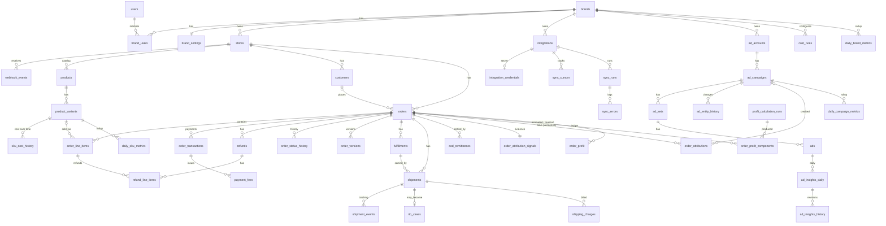

# D2C Profit OS: V1 Database Design

| | |
|---|---|
| **Status** | PROPOSAL, for review. Nothing in this document is implemented. |
| **Branch** | `v1-foundation` |
| **Date** | 26 Sep 2026 |
| **Scope** | Multi-tenant data foundation for Shopify + Meta Ads + courier + Google Sheets profit analytics |
| **Inputs** | `audits/autopost-v1-repo-audit.md`; Phase 1 (security foundation) results; current `src/lib/db/schema/*`, `drizzle/*`, `src/lib/auth/*` |

> **No database, migration or code changes were made while producing this document.** This design proposes *new* tables alongside the existing ones. Old tables are retired only after cut-over and your explicit approval.

---

## 1. Executive architecture

**Goal.** A live, trustworthy profit dashboard for 50–100 D2C brands (and more later). Every number on it must be explainable back to raw source records.

**Design principles**

1. **Raw first, derived second.** Store what the source systems said (Shopify orders, Meta insights, courier events), exactly and with its version. Every profit number is *derived* from raw data plus versioned cost rules, and can be recomputed at any time.
2. **Components, not totals.** Profit is stored as a ledger of components per order (revenue, discount, refund, COGS, forward shipping, RTO shipping, COD fee, gateway fee, other). Totals are sums of components. "Profit" is never stored without its parts.
3. **Historical correctness through effective dating and snapshotting.**
   - Costs are effective-dated rules.
   - Every calculation records *which* rule version and value it used.
   - Recalculation supersedes old rows; it never overwrites them.
4. **Honest attribution.**
   - Spend is exact (from Meta).
   - Order→campaign links exist only where evidence exists (UTM IDs, `fbclid`, campaign names). Each link records its method and confidence.
   - Everything else is shown as *Unattributed*.
   - Meta-reported conversions are shown next to our numbers, never mixed with them.
   - Spend is never used to allocate orders or revenue.
5. **A hard tenant boundary in three layers:**
   1. app guard (Phase 1)
   2. `brand_id` on every brand-owned row, plus composite foreign keys
   3. Postgres RLS (designed here, implemented later)
6. **Idempotent ingestion.**
   - Every inbound event has a natural idempotency key.
   - Every entity has a unique external key.
   - Writes are "upsert if newer" under a per-entity lock.
7. **Live, but pull-based for data.**
   - Realtime carries *invalidations* ("brand X, date D changed"), never financial numbers.
   - The dashboard re-reads through the authorized API.

**High-level flow**

```
            ┌──────────────┐   ┌────────────┐   ┌──────────────┐   ┌──────────────┐
 Sources →  │ Shopify      │   │ Meta Ads   │   │ Courier API  │   │ Google Sheets│
            │ webhooks+API │   │ Graph API  │   │ / webhooks   │   │ (imports)    │
            └──────┬───────┘   └─────┬──────┘   └──────┬───────┘   └──────┬───────┘
                   ▼                 ▼                 ▼                  ▼
 Ingest     webhook_events      sync_runs / sync_cursors / sync_errors  data_import_runs/rows
 (raw)             │ (dedupe)        │                 │                  │
                   ▼                 ▼                 ▼                  ▼
 Normalize  orders, line items,   ad_accounts…ads,   shipments,        sku_cost_history,
 (source    transactions, refunds ad_insights_daily  shipment_events,  cost_rules, shipping_charges,
  of truth) fulfillments, customers (+history)       rto_cases         cod_remittances
                   │                 │                 │                  │
                   └────────┬────────┴────────┬────────┴──────────────────┘
                            ▼                 ▼
 Derive          order_attributions    profit engine (pure, versioned)
                            │                 │
                            ▼                 ▼
                 order_profit_components (ledger) → order_profit (current)
                            │
                            ▼
 Serve           daily_brand_metrics / daily_campaign_metrics / daily_sku_metrics
                            │
                            ▼
                 domain_events (outbox) → realtime invalidation → dashboard re-fetch (guarded API)
```

---

## 2. Existing repository / database findings

**What exists today.** All tables are defined in `src/lib/db/schema/*.ts`, with a single migration `drizzle/0000_rare_sister_grimm.sql` (28 tables).

| Area | Existing tables | Assessment for V1 |
|---|---|---|
| Identity | `users`, `accounts`, `sessions` | **Keep.** Auth.js (JWT sessions). `accounts`/`sessions` are unused with JWT sessions but harmless. `users.role` (admin/operator) is platform-level and grants no brand access (enforced in Phase 1). |
| Tenancy | `brands`, `brand_users` | **Keep and evolve.** `brand_users` has **no PK/unique** (duplicates possible; Phase 1 mitigates by using the least-privileged role). `brands.default_cogs_percentage` is a varchar and unused. |
| Integrations | `platform_connections` | **Replace.** Unique on `(brand, platform)`, so only one store and one ad account per brand. Secrets are plaintext inside `access_token` and `metadata` jsonb. |
| Shopify | `shopify_products`, `shopify_variants`, `shopify_orders`, `shopify_order_items`, `transaction_fees` | **Replace.** Child tables have no `brand_id`. No COD/partial-COD, UTM, line discounts, refunds table, fulfillment or delivery fields. `quantity` is text. Updates only touch two status columns. No unique constraint on line items or variants. |
| Ads | `ad_campaigns`, `ad_sets`, `ads`, `ad_data_snapshots` | **Replace.** No ad-account dimension. `ad_sets`/`ads` have no `brand_id` and no unique constraints. The snapshot unique key includes a nullable `ad_id`, which **allows duplicates**. Campaign-level only; no purchase value. |
| Costs | `custom_expenses` | **Evolve** into `fixed_expenses` (overheads). No variable-cost model exists. |
| Sync/ops | `platform_sync_logs` | **Replace** with `sync_runs` / `sync_errors` / `sync_cursors`. |
| Out of V1 scope | `ai_*`, `pixel_events`, `capi_events`, `notification_*`, `telegram_configs`, `subscriptions`, `invoices`, `payment_methods`, `usage_records` | **Leave untouched.** |

**Other findings**
- **Driver.** `src/lib/db/index.ts` uses `drizzle-orm/neon-http`, which has **no interactive transactions** and **no session variables** (`SET LOCAL`). Both are required for this design: idempotent multi-table upserts, advisory locks, and RLS identity. A pooled TCP/WebSocket driver (`postgres-js`, `pg`, or `@neondatabase/serverless` Pool) is needed.
- **Unrelated database.** `drizzle/schema.ts` and `drizzle/relations.ts` are an introspection of an **unrelated database** (Next.js tutorial tables). Treat the database behind the current `DATABASE_URL` as unknown. V1 must start on a **fresh** database or branch.
- **No RLS, no triggers, no views, no partitioning** in the current migration.
- **Hosting.** The README mentions Neon; this brief mentions Supabase. See Decision D1/D2.
- **Phase 1 authorization is in place:**
  - `src/lib/auth/roles.ts`: `viewer < manager < owner`
  - `src/lib/auth/membership.ts`: a single join of `brand_users` to `brands`
  - `src/lib/auth/guard.ts`: `requireBrandRole` returns 401/404/403
  - 390 passing tests
- **Money and dates.** Money is `decimal(10,2)`, with some money stored as `varchar`. Dates are stored as `text`. The new design standardizes both (§5.0).

---

## 3. Proposed database architecture

### 3.1 Layers

| Layer | Purpose | Mutability |
|---|---|---|
| **L0 Tenancy & identity** | users, brands, memberships, settings | Mutable, audited |
| **L1 Integration & ingestion** | stores, integrations, credentials, webhook events, sync runs/cursors/errors, import runs | Events append-only; state mutable |
| **L2 Source mirror (normalized raw)** | products, variants, customers, orders, line items, transactions, refunds, fulfillments, shipments, shipment events, ad entities, ad insights | Mutable "latest state" **plus** append-only history/version tables |
| **L3 Business configuration** | SKU cost history, cost rules, payment method mappings, fixed expenses, period locks | Effective-dated, versioned; old versions never edited |
| **L4 Derived** | attribution signals and links, profit calculation runs, profit components, order profit | Append-only ledger + current projection |
| **L5 Serving** | daily brand/campaign/SKU metrics | Recomputable projections (idempotent re-aggregation) |
| **L6 Ops & events** | domain events (outbox), dashboard updates, audit logs, business events | Append-only |

### 3.2 Table inventory (57 tables)

| # | Table | Layer | Status |
|---|---|---|---|
| 1 | `users` | L0 | existing, keep |
| 2 | `accounts` | L0 | existing, keep (Auth.js) |
| 3 | `sessions` | L0 | existing, keep (Auth.js) |
| 4 | `brands` | L0 | existing, **evolve** |
| 5 | `brand_users` | L0 | existing, **evolve** (PK) |
| 6 | `brand_settings` | L0 | new |
| 7 | `stores` | L1 | new |
| 8 | `integrations` | L1 | new (replaces `platform_connections`) |
| 9 | `integration_credentials` | L1 | new |
| 10 | `sync_cursors` | L1 | new |
| 11 | `products` | L2 | new (replaces `shopify_products`) |
| 12 | `product_variants` | L2 | new (replaces `shopify_variants`) |
| 13 | `sku_cost_history` | L3 | new |
| 14 | `customers` | L2 | new |
| 15 | `orders` | L2 | new (replaces `shopify_orders`) |
| 16 | `order_line_items` | L2 | new (replaces `shopify_order_items`) |
| 17 | `order_transactions` | L2 | new (payments) |
| 18 | `refunds` | L2 | new |
| 19 | `refund_line_items` | L2 | new |
| 20 | `order_status_history` | L2 | new, append-only |
| 21 | `order_versions` | L2 | new, append-only |
| 22 | `payment_method_mappings` | L3 | new |
| 23 | `cod_remittances` | L2 | new |
| 24 | `fulfillments` | L2 | new |
| 25 | `shipments` | L2 | new |
| 26 | `shipment_events` | L2 | new, append-only (shipping and RTO events) |
| 27 | `rto_cases` | L2 | new |
| 28 | `shipping_charges` | L2 | new, append-only ledger |
| 29 | `ad_accounts` | L2 | new |
| 30 | `ad_campaigns` | L2 | new (replaces existing) |
| 31 | `ad_sets` | L2 | new (replaces existing) |
| 32 | `ads` | L2 | new (replaces existing) |
| 33 | `ad_entity_history` | L2 | new, append-only |
| 34 | `ad_insights_daily` | L2 | new (replaces `ad_data_snapshots`) |
| 35 | `ad_insights_history` | L2 | new, append-only |
| 36 | `order_attribution_signals` | L4 | new |
| 37 | `order_attributions` | L4 | new |
| 38 | `cost_rules` | L3 | new |
| 39 | `payment_fees` | L2 | new, append-only (actual gateway fees) |
| 40 | `fixed_expenses` | L3 | new (evolves `custom_expenses`) |
| 41 | `sheet_sources` | L1 | new |
| 42 | `data_import_runs` | L1 | new |
| 43 | `data_import_rows` | L1 | new, append-only |
| 44 | `profit_calculation_runs` | L4 | new, append-only |
| 45 | `order_profit_components` | L4 | new, append-only ledger |
| 46 | `order_profit` | L4 | new, current projection |
| 47 | `daily_brand_metrics` | L5 | new |
| 48 | `daily_campaign_metrics` | L5 | new |
| 49 | `daily_sku_metrics` | L5 | new |
| 50 | `period_locks` | L3 | new |
| 51 | `webhook_events` | L1 | new, append-only |
| 52 | `sync_runs` | L1 | new |
| 53 | `sync_errors` | L1 | new, append-only |
| 54 | `domain_events` | L6 | new, append-only (outbox) |
| 55 | `dashboard_updates` | L6 | new, **optional** (Decision D18) |
| 56 | `audit_logs` | L6 | new, append-only |
| 57 | `business_events` | L6 | new (annotations for V2 AI) |

**Summary: 57 tables.**
- 3 kept as-is.
- 2 evolved.
- 52 new, one of them optional.
- The existing Shopify, ads, `transaction_fees`, `platform_connections`, `platform_sync_logs` and `custom_expenses` tables are **deprecated after cut-over** (not deleted in this phase).
- Out-of-scope tables (AI, CAPI, pixel, notifications, billing) are untouched.

---

## 4. Entity relationship overview



*(Every table except `users`, `accounts` and `sessions` also carries `brand_id → brands.id`; those edges are omitted for readability.)*

---

## 5. Detailed table-by-table design

### 5.0 Conventions (apply to every table unless stated otherwise)

| Convention | Rule |
|---|---|
| **Primary keys** | `id uuid` (UUIDv7, time-ordered, for index locality; generated in the app or with PG18 `uuidv7()`). See D19. |
| **Tenant key** | Every brand-owned table has `brand_id uuid NOT NULL`. That includes child tables such as line items and events. It is denormalized on purpose, for RLS, partitioning and index prefixes. |
| **Tenant-safe foreign keys** | Parent tables expose `UNIQUE (brand_id, id)`. Children reference the parent with **composite FKs** `(brand_id, parent_id) → parent(brand_id, id)`, so the database itself refuses to link a Brand A child to a Brand B parent. |
| **External IDs** | `external_id text` holds the source's stable ID (Shopify GID `gid://shopify/Order/123`, Meta numeric ID as text). `external_legacy_id bigint` holds the Shopify numeric ID where useful. Uniqueness is always scoped: `(store_id, external_id)` or `(ad_account_id, external_id)`. |
| **Source freshness** | Mirrored rows carry `source_updated_at timestamptz` (the source's `updatedAt`), `ingested_at timestamptz` and `last_event_id uuid → webhook_events / sync_runs`. |
| **Money** | `numeric(14,2)` plus `currency char(3)`. The brand's base currency is in `brand_settings`. Calculations use a decimal library, never JS floats. Percentages are `numeric(7,4)`. |
| **Time** | Timestamps are `timestamptz` (UTC). Business dates are `date` columns computed in the **brand timezone** (e.g. `order_date_local`). |
| **Enums** | Postgres enums for stable sets (payment mode, shipment status). A `text` + `CHECK` for fast-moving sets. Unknown source values keep their raw text in a `*_raw` column. |
| **Soft delete** | Source-deleted entities get `deleted_at`. Rows are never hard-deleted while financial rows reference them. |
| **Audit columns** | `created_at`, `updated_at` (trigger-maintained). |
| **Append-only tables** | No `UPDATE`/`DELETE` grants for the app roles; corrections are new rows. |

Each table below is described as: purpose · PK · FKs · tenant · columns · enums · unique · indexes · history · source of truth · mutability.

---

### A. Tenancy & identity

#### T1. `users` (existing, keep)
- **Purpose:** a person who can sign in (Auth.js).
- **PK:** `id uuid`. **FKs:** none. **Tenant:** global (not brand-owned).
- **Columns:** `email` (unique), `password_hash`, `name`, `role` (platform: `admin`/`operator`; **grants no brand access**), `email_verified`.
- **History:** audited via `audit_logs`. **Source of truth:** our app. **Mutability:** mutable.

#### T2–T3. `accounts`, `sessions` (existing, keep)
- Auth.js tables. Unchanged in V1. `accounts` becomes relevant if the Drizzle adapter is enabled for OAuth (this also fixes the Google `token.id` bug flagged in Phase 1).

#### T4. `brands` (existing, evolve)
- **Purpose:** the tenant. One D2C brand, the unit of data isolation and billing.
- **PK:** `id`. **FKs:** `organization_id → organizations.id` (only if D3 = yes).
- **Columns (V1):** `name`, `slug` (unique), `status` (`active`, `suspended`, `archived`), `created_at`, `updated_at`.
- **Changes:**
  - Move `timezone`, `currency` and `default_cogs_percentage` into `brand_settings`, keeping them readable during transition.
  - Add `UNIQUE (id)` (the PK already) so children can use composite FKs `(brand_id, …)`.
- **Mutability:** mutable, audited.

#### T5. `brand_users` (existing, evolve)
- **Purpose:** membership plus role; the basis of both the app guard and RLS.
- **PK:** **`(brand_id, user_id)`** (new; de-duplicate existing rows first by keeping the least-privileged role, matching Phase 1 behaviour).
- **FKs:** `brand_id → brands` (cascade), `user_id → users` (cascade).
- **Columns:** `role` enum `brand_role ('viewer','manager','owner')`, `invited_by`, `created_at`, `updated_at`.
- **Indexes:** `(user_id, brand_id)`, which serves "my brands" and the RLS membership lookup.
- **History:** role changes are written to `audit_logs`. **Mutability:** mutable.
- **Constraint:** a brand must always have ≥ 1 owner (enforced in the service layer; optionally a deferred trigger).

#### T6. `brand_settings` (new)
- **Purpose:** 1:1 brand configuration that is not a dated cost.
- **PK:** `brand_id` (FK → brands).
- **Columns:**
  - `timezone` (default `Asia/Kolkata`), `base_currency` (default `INR`)
  - `revenue_tax_mode` (`exclusive_gst`/`inclusive_gst`), `include_shipping_charged_in_revenue bool` (D5)
  - `cogs_recognition_date` (`order_date`/`dispatch_date`), D7
  - `rto_cogs_policy` (`full_reversal`/`write_off_pct`), `rto_write_off_pct`, D8
  - `default_expected_delivery_rate_cod`, `default_expected_delivery_rate_prepaid`, D10
  - `attribution_lookback_days`, `attribution_precedence jsonb`, D11
- **History:** these settings change profit, so every change writes `audit_logs` **and** starts a new `profit_calculation_run` scope (§15).
- **Mutability:** mutable, audited.

---

### B. Integrations

#### T7. `stores` (new)
- **Purpose:** one Shopify shop connected to a brand. A brand may have several (D4).
- **PK:** `id`. **FKs:** `(brand_id)`, `integration_id → integrations`. **Tenant:** `brand_id`.
- **Columns:** `platform` (`shopify`), `shop_domain` (`*.myshopify.com`), `shop_gid`, `name`, `currency`, `iana_timezone`, `plan`, `status` (`connected`, `disconnected`, `uninstalled`, `error`), `installed_at`, `uninstalled_at`, `api_version`.
- **Unique:** **`UNIQUE (platform, shop_domain)`**, **globally**: a shop can belong to only one brand. This prevents two tenants from ingesting the same store, a flaw in the current code.
- **Indexes:** `(brand_id)`. **Source of truth:** Shopify `shop` object + install flow. **Mutability:** mutable.

#### T8. `integrations` (new; replaces `platform_connections`)
- **Purpose:** a connection from a brand to an external system.
- **PK:** `id`. **FKs:** `brand_id`. **Tenant:** `brand_id`.
- **Columns:**
  - `provider` enum: `shopify`, `meta_ads`, `google_sheets`, `shiprocket`, `delhivery`, `other_courier`, `razorpay` (future)
  - `external_account_id` (shop domain, `act_…`, sheet ID, courier account)
  - `display_name`, `status` (`active`, `needs_reauth`, `paused`, `error`, `revoked`)
  - `scopes text[]`, `token_expires_at`, `last_success_at`, `last_error_at`, `last_error_code`, `config jsonb` (**non-secret only**)
- **Unique:** `(provider, external_account_id)` globally for Shopify and Meta (one owner), and `(brand_id, provider, external_account_id)` for the others.
- **Indexes:** `(brand_id, provider)`, `(status)` where not active. **Mutability:** mutable, audited.

#### T9. `integration_credentials` (new)
- **Purpose:** secrets, isolated from everything else.
- **PK:** `integration_id` (FK). **Tenant:** `brand_id`.
- **Columns:** `ciphertext bytea`, `key_version int`, `algorithm` (`aes-256-gcm`), `rotated_at`.
- **RLS:** **no policy for app roles** (deny all). Only the worker/service role can read it, and it decrypts in application code.
- **Guarantee:** API responses cannot leak secrets because the request path never reads this table.
- **Mutability:** mutable (rotation); old versions are not kept.

#### T10. `sync_cursors` (new)
- **Purpose:** incremental sync position per integration and resource.
- **PK:** `(integration_id, resource)`, e.g. `shopify.orders`, `meta.insights.ad`, `courier.shipments`. **Tenant:** `brand_id`.
- **Columns:** `cursor jsonb` (e.g. `{updated_at_min, page_info}` or `{date}`), `high_watermark timestamptz`, `last_run_id`, `updated_at`.
- **Mutability:** mutable.

---

### C. Catalog & costs of goods

#### T11. `products` (new)
- **Purpose:** Shopify product (mirror).
- **PK:** `id`. **FKs:** `(brand_id, store_id) → stores`. **Tenant:** `brand_id`.
- **Columns:** `external_id` (GID), `external_legacy_id`, `title`, `handle`, `product_type`, `vendor`, `status`, `tags text[]`, `source_updated_at`, `deleted_at`.
- **Unique:** `(store_id, external_id)`. **Indexes:** `(brand_id, status)`.
- **History:** not needed in detail; changes are captured in `webhook_events`. **Source of truth:** Shopify. **Mutability:** mutable mirror.

#### T12. `product_variants` (new)
- **Purpose:** the sellable SKU. This is the grain for COGS.
- **PK:** `id`. **FKs:** `(brand_id, product_id) → products`. **Tenant:** `brand_id`.
- **Columns:** `external_id`, `external_legacy_id`, `sku`, `title`, `price`, `compare_at_price`, `inventory_item_id`, `grams`, `shopify_unit_cost` (as reported by Shopify, informational), `source_updated_at`, `deleted_at`.
- **Unique:** `(store_id, external_id)`.
- **Indexes:** `(brand_id, sku)` (not unique: SKUs repeat across stores and can be blank), `(brand_id, inventory_item_id)`.
- **Mutability:** mutable mirror.

#### T13. `sku_cost_history` (new) ★ historical correctness
- **Purpose:** effective-dated unit cost (COGS) per variant or SKU.
- **PK:** `id`. **FKs:** `(brand_id, variant_id) → product_variants` (nullable when keyed by SKU only). **Tenant:** `brand_id`.
- **Columns:**
  - `sku`, `unit_cost numeric(14,4)`, `currency`
  - cost breakdown (optional): `material`, `labour`, `packaging_included bool`
  - `effective_from date`, `effective_to date NULL` (open-ended)
  - `source` (`manual`, `google_sheets`, `shopify_unit_cost`, `csv`), `source_ref` (import row ID), `created_by`, `superseded_at`
- **Constraint:** no overlapping ranges per `(brand_id, coalesce(variant_id, sku))`, via an `EXCLUDE USING gist` on `daterange(effective_from, effective_to)`.
- **Indexes:** `(brand_id, variant_id, effective_from DESC)`, `(brand_id, sku, effective_from DESC)`.
- **History:** **all versions kept.** A new price closes the previous row (`effective_to`) and inserts a new one. Old rows are never edited except to set `effective_to` / `superseded_at`.
- **Source of truth:** our app / Sheets. **Mutability:** append-mostly (range close only).

#### T14. `customers` (new)
- **Purpose:** buyer identity for repeat-rate and RTO-risk analysis (V2). Minimal PII.
- **PK:** `id`. **FKs:** `(brand_id, store_id)`. **Tenant:** `brand_id`.
- **Columns:** `external_id`, `email_hash`, `phone_hash` (SHA-256 of the normalized value plus a per-brand salt), `first_order_at`, `orders_count`, `default_pincode`, `default_state`, `default_city`, `accepts_marketing`, `source_updated_at`, `redacted_at` (GDPR `customers/redact`).
- **Unique:** `(store_id, external_id)`. **Indexes:** `(brand_id, phone_hash)`, `(brand_id, default_pincode)`.
- **Mutability:** mutable; redaction nulls the hashes and address fields.

---

### D. Orders & payments

#### T15. `orders` (new) ★ core
- **Purpose:** the latest normalized state of a Shopify order.
- **PK:** `id`. **FKs:** `(brand_id, store_id) → stores`, `(brand_id, customer_id) → customers` (nullable). **Tenant:** `brand_id`.
- **Columns:**
  - **Identity:** `external_id` (GID), `external_legacy_id`, `name` (#1001), `source_name` (web, pos, draft), `test bool`
  - **Times:** `created_at_source`, `processed_at`, `cancelled_at`, `cancel_reason`, `closed_at`, `source_updated_at`, `order_date_local date` (brand timezone)
  - **Money (shop currency):** `currency`, `subtotal`, `total_discounts`, `total_tax`, `shipping_charged`, `total_price`, `current_total_price` (after edits/refunds), `total_refunded`, `total_outstanding`, `total_received`
  - **Payment:** `payment_gateway_names text[]`, **`payment_mode`** enum, `payment_mode_source` (`rule`, `mapping`, `manual`), `payment_mode_rule_version`, `prepaid_amount`, `cod_amount`
  - **Status:** `financial_status` enum (Shopify display financial status), `fulfillment_status` enum, **`delivery_state`** enum (derived from shipments), `is_rto bool`, `rto_at`, `delivered_at`
  - **Attribution inputs:** these live in `order_attribution_signals` (not here), to keep this row narrow.
  - **Other:** `tags text[]`, `note_attributes jsonb`, `shipping_pincode`, `shipping_state`, `shipping_city`, `discount_codes text[]`, `raw_ref` (latest `order_versions.id`), `last_event_id`, `ingested_at`
- **Enums:**
  - `payment_mode ('cod','prepaid','partial_cod','unknown')`
  - `delivery_state ('unfulfilled','in_transit','delivered','partially_delivered','rto_in_transit','rto_delivered','cancelled','lost','unknown')`
- **Unique:** **`(store_id, external_id)`**, the idempotency anchor. Also `(brand_id, id)` for composite FKs.
- **Indexes:**
  - `(brand_id, order_date_local)`
  - `(brand_id, payment_mode, order_date_local)`
  - `(brand_id, delivery_state)` partial where not terminal
  - `(brand_id, source_updated_at)`
  - `(store_id, external_legacy_id)`
- **History:** kept in `order_status_history` (every status transition) and `order_versions` (raw payload versions).
- **Source of truth:** Shopify, except `delivery_state` (courier > Shopify fulfillment events > Sheets; see §10).
- **Mutability:** mutable, **only via the "upsert if newer" path** (§16).

#### T16. `order_line_items` (new)
- **Purpose:** the items in an order. This is the grain for SKU profit.
- **PK:** `id`. **FKs:** `(brand_id, order_id) → orders`, `(brand_id, variant_id) → product_variants` (nullable: deleted products, custom items). **Tenant:** `brand_id`.
- **Columns:**
  - identity: `external_id`, `sku`, `title`, `variant_title`
  - quantities: `quantity` (original, int), `current_quantity` (after edits/removals), `fulfillable_quantity`
  - prices: `unit_price` (original), `total_discount_allocated`, `tax_amount`, `line_net_amount` (computed: `unit_price × current_quantity − discount`)
  - flags: `requires_shipping`, `grams`, `removed_at` (order edit)
- **Unique:** `(order_id, external_id)`. **Indexes:** `(brand_id, variant_id)`, `(brand_id, sku)`.
- **History:** order edits change `current_quantity`. The previous state is preserved in `order_versions`, and edits emit an `order_status_history` row of type `edited`.
- **Mutability:** mutable (upserted with the order; lines are never deleted, only marked `removed_at`).

#### T17. `order_transactions` (new): "payments"
- **Purpose:** money movements on the order (Shopify `OrderTransaction`). Determines prepaid versus COD collected, and partial COD.
- **PK:** `id`. **FKs:** `(brand_id, order_id)`. **Tenant:** `brand_id`.
- **Columns:** `external_id`, `kind` (`authorization`, `capture`, `sale`, `void`, `refund`, `change`), `status` (`success`, `failure`, `pending`, `error`), `gateway`, `amount`, `currency`, `processed_at`, `parent_external_id`, `is_manual_gateway bool`, `test bool`, `error_code`, `receipt_ref` (the gateway payment ID, e.g. Razorpay `pay_…`; no card data).
- **Unique:** `(order_id, external_id)`. **Indexes:** `(brand_id, gateway, processed_at)`.
- **History:** Shopify transactions are immutable facts, so this table is effectively **append-only**; status updates are rare.
- **Source of truth:** Shopify.

#### T18. `refunds` (new)
- **Purpose:** refund events per order.
- **PK:** `id`. **FKs:** `(brand_id, order_id)`. **Tenant:** `brand_id`.
- **Columns:** `external_id`, `created_at_source`, `note`, `total_refunded` (sum of refund transactions), `shipping_refunded`, `restock bool`, `refund_date_local`, `source` (`shopify`, `manual`), because COD refunds are often paid by bank transfer outside Shopify (D21).
- **Unique:** `(order_id, external_id)` (manual refunds use a generated external ID). **Mutability:** append-only.

#### T19. `refund_line_items` (new)
- **Purpose:** which lines and quantities were refunded or restocked. Drives COGS reversal.
- **PK:** `id`. **FKs:** `(brand_id, refund_id)`, `(brand_id, order_line_item_id)`. **Tenant:** `brand_id`.
- **Columns:** `external_id`, `quantity`, `subtotal`, `tax`, `restock_type` (`return`, `cancel`, `no_restock`).
- **Unique:** `(refund_id, external_id)`. **Mutability:** append-only.

#### T20. `order_status_history` (new, append-only)
- **Purpose:** every observed change in financial, fulfillment, delivery, payment-mode or cancel state, plus edits. Powers timelines, "time to deliver" and "why did profit change", and V2 AI.
- **PK:** `id`. **FKs:** `(brand_id, order_id)`, `event_ref` (webhook_event / shipment_event / import row). **Tenant:** `brand_id`.
- **Columns:** `dimension` (`financial`, `fulfillment`, `delivery`, `payment_mode`, `cancel`, `edit`), `from_value`, `to_value`, `occurred_at` (source time), `recorded_at`, `source`.
- **Indexes:** `(brand_id, order_id, occurred_at)`, `(brand_id, dimension, to_value, occurred_at)`.
- **Mutability:** **append-only** (partition by month at scale).

#### T21. `order_versions` (new, append-only)
- **Purpose:** the raw Shopify order payload as it was at each distinct version. Used for audit, reprocessing and replay after parser fixes.
- **PK:** `id`. **FKs:** `(brand_id, order_id)`. **Tenant:** `brand_id`.
- **Columns:** `source_updated_at`, `payload_hash` (SHA-256 of canonical JSON), `payload jsonb` (compressed via TOAST), `api_version`, `received_via` (`webhook`, `poll`, `backfill`).
- **Unique:** `(order_id, payload_hash)`, so identical re-deliveries do not create versions.
- **Retention:** see §20 (e.g. keep all versions for 13 months, then keep only the latest version plus versions referenced by locked periods).
- **Mutability:** append-only.

#### T22. `payment_method_mappings` (new)
- **Purpose:** brand-configurable rules that classify gateways and tags into `cod` / `prepaid` / `partial_cod`, because Indian checkouts (GoKwik, Shopflo, Razorpay Magic, manual "Cash on Delivery (COD)") label these inconsistently.
- **PK:** `id`. **Tenant:** `brand_id` (nullable = platform default rule).
- **Columns:** `match_type` (`gateway_equals`, `gateway_contains`, `tag_equals`, `note_attribute`), `match_value`, `maps_to` (`payment_mode`), `priority`, `effective_from`, `effective_to`, `version`.
- **History:** versioned. Orders store the `payment_mode_rule_version` they were classified with.
- **Mutability:** append-mostly.

#### T23. `cod_remittances` (new)
- **Purpose:** COD cash actually remitted by the courier (from the courier API or a Sheets import). This is what makes COD revenue "realized".
- **PK:** `id`. **FKs:** `(brand_id, order_id)` (nullable until matched), `(brand_id, shipment_id)`, `integration_id`. **Tenant:** `brand_id`.
- **Columns:** `awb`, `remittance_ref` (UTR / batch ID), `cod_amount_collected`, `amount_remitted`, `deductions` (COD fee, freight adjustments), `remitted_at`, `source`, `source_row_ref`.
- **Unique:** `(brand_id, source, remittance_ref, awb)`.
- **Mutability:** append-only (corrections are new rows with `adjusts_id`).

---

### E. Fulfillment, shipping, delivery & RTO

#### T24. `fulfillments` (new)
- **Purpose:** Shopify fulfillment (dispatch record), including the tracking numbers Shopify knows about.
- **PK:** `id`. **FKs:** `(brand_id, order_id)`. **Tenant:** `brand_id`.
- **Columns:** `external_id`, `status` (`pending`, `open`, `success`, `cancelled`, `error`, `failure`), `shipment_status` (Shopify event status when present: `in_transit`, `out_for_delivery`, `delivered`, `failure`, …), `tracking_company`, `tracking_numbers text[]`, `location_id`, `created_at_source`, `source_updated_at`.
- **Unique:** `(order_id, external_id)`. **Mutability:** mutable mirror.

#### T25. `shipments` (new)
- **Purpose:** one parcel / AWB with a courier. The grain for delivery, RTO and shipping cost.
- **PK:** `id`. **FKs:** `(brand_id, order_id)`, `(brand_id, fulfillment_id)` (nullable), `integration_id` (courier). **Tenant:** `brand_id`.
- **Columns:**
  - `awb`, `courier_name`, `courier_integration_ref` (e.g. Shiprocket shipment ID)
  - **status:** `status` enum (normalized), `status_raw`, `status_at`
  - **route:** `origin_pincode`, `destination_pincode`, `zone`
  - **weight:** `dead_weight_g`, `volumetric_weight_g`, `charged_weight_g`
  - **timestamps:** `picked_up_at`, `delivered_at`, `rto_initiated_at`, `rto_delivered_at`, `ndr_count`, `last_event_at`
  - `is_cod bool`, `cod_amount`
- **Enum `shipment_status`:** `created`, `pickup_scheduled`, `picked_up`, `in_transit`, `out_for_delivery`, `delivery_failed` (NDR), `delivered`, `rto_initiated`, `rto_in_transit`, `rto_delivered`, `lost`, `damaged`, `cancelled`.
- **Unique:** `(brand_id, courier_name, awb)`.
- **Indexes:** `(brand_id, status)` partial (non-terminal), `(brand_id, order_id)`, `(brand_id, destination_pincode)`.
- **History:** in `shipment_events`. **Source of truth:** courier > Shopify fulfillment event > Sheets import (§10). **Mutability:** mutable projection of the event log.

#### T26. `shipment_events` (new, append-only): "shipping events" + "RTO events"
- **Purpose:** the full tracking history, including NDR attempts and RTO milestones. RTO *events* live here; RTO *cases* (lifecycle + cost) live in T27.
- **PK:** `id`. **FKs:** `(brand_id, shipment_id)`. **Tenant:** `brand_id`.
- **Columns:** `event_time`, `status` (normalized enum), `status_raw`, `location`, `remark`, `ndr_reason`, `source` (`courier_webhook`, `courier_poll`, `shopify_fulfillment_event`, `sheet`), `source_event_id`, `received_at`.
- **Unique:** `(shipment_id, source, source_event_id)`, or where the source has no event ID, `(shipment_id, status_raw, event_time)`. This deduplicates re-sent tracking events.
- **Indexes:** `(brand_id, shipment_id, event_time)`. Partition monthly at scale.
- **Mutability:** **append-only.**

#### T27. `rto_cases` (new)
- **Purpose:** RTO lifecycle and its financial consequences, per shipment.
- **PK:** `id`. **FKs:** `(brand_id, shipment_id)` unique, `(brand_id, order_id)`. **Tenant:** `brand_id`.
- **Columns:**
  - lifecycle: `initiated_at`, `reason` (`customer_refused`, `not_reachable`, `address_issue`, `fake_order`, `other`), `rto_delivered_at`
  - inspection: `received_qc_status` (`restockable`, `damaged`, `missing`), `units_restocked`, `units_written_off`
  - `closed_at`
- **Unique:** `(shipment_id)`. **History:** each transition is an event in `shipment_events` / `order_status_history`.
- **Mutability:** mutable (lifecycle), audited.

#### T28. `shipping_charges` (new, append-only ledger)
- **Purpose:** **actual** courier charges per shipment, from courier invoices, API or Sheets. Estimates come from `cost_rules`; actuals replace estimates when present.
- **PK:** `id`. **FKs:** `(brand_id, shipment_id)`, `data_import_run_id` (nullable). **Tenant:** `brand_id`.
- **Columns:** `charge_type` (`forward_freight`, `rto_freight`, `cod_fee`, `weight_discrepancy`, `ndr_fee`, `other`), `amount`, `tax_amount`, `currency`, `invoice_ref`, `charged_at`, `source`, `adjusts_id` (for credit notes).
- **Unique:** `(brand_id, source, invoice_ref, shipment_id, charge_type)`.
- **Mutability:** **append-only** (corrections are adjusting rows).

---

### F. Meta Ads

#### T29. `ad_accounts` (new)
- **Purpose:** a Meta ad account linked to a brand. A brand may have several.
- **PK:** `id`. **FKs:** `(brand_id)`, `integration_id`. **Tenant:** `brand_id`.
- **Columns:** `platform` (`meta`), `external_id` (`act_…`), `name`, `currency`, `timezone_name`, `timezone_offset_hours_utc`, `account_status`, `business_id`, `status` (ours: `active`, `paused_sync`, `disconnected`).
- **Unique:** **`(platform, external_id)` globally** (one owner brand). **Indexes:** `(brand_id)`.
- **Mutability:** mutable.

#### T30. `ad_campaigns` (new)
- **PK:** `id`. **FKs:** `(brand_id, ad_account_id) → ad_accounts`. **Tenant:** `brand_id`.
- **Columns:** `external_id`, `name`, `objective`, `status`, `effective_status`, `buying_type`, `daily_budget`, `lifetime_budget`, `bid_strategy`, `special_ad_categories`, `created_time_source`, `source_updated_at`, `deleted_at`.
- **Unique:** `(ad_account_id, external_id)`. **Indexes:** `(brand_id, status)`, trigram on `name` (UTM name matching).
- **History:** config changes go to `ad_entity_history`. **Mutability:** mutable mirror.

#### T31. `ad_sets` (new)
- Same pattern. **FKs:** `(brand_id, campaign_id)`.
- **Columns:** `external_id`, `name`, `status`, `effective_status`, `daily_budget`, `lifetime_budget`, `optimization_goal`, `billing_event`, `bid_amount`, `targeting_hash`, `targeting jsonb` (trimmed), `start_time`, `end_time`, `source_updated_at`.
- **Unique:** `(ad_account_id, external_id)`.

#### T32. `ads` (new)
- Same pattern. **FKs:** `(brand_id, ad_set_id)`. `campaign_id` is denormalized for fast rollups.
- **Columns:** `external_id`, `name`, `status`, `effective_status`, `creative_external_id`, `creative_snapshot jsonb` (title, body, CTA, thumbnail URL, video ID; for V2 creative analysis), `url_tags` (the UTM template actually configured), `source_updated_at`.
- **Unique:** `(ad_account_id, external_id)`.

#### T33. `ad_entity_history` (new, append-only)
- **Purpose:** what changed on campaigns, ad sets and ads, and when (budget, status, bid, targeting, creative). Essential for V2 "why did this campaign change".
- **PK:** `id`. **Tenant:** `brand_id`.
- **Columns:** `entity_level` (`campaign`, `adset`, `ad`), `entity_id`, `changed_fields text[]`, `before jsonb`, `after jsonb`, `observed_at`, `source` (`sync_diff`, `meta_activity_log`).
- **Indexes:** `(brand_id, entity_level, entity_id, observed_at)`. **Mutability:** append-only.

#### T34. `ad_insights_daily` (new): "ad spend / insights"
- **Purpose:** the latest known daily metrics **at ad level**. Campaign and ad-set numbers are rollups of this table, so there is exactly one source for spend.
- **PK:** `id`. **FKs:** `(brand_id, ad_id)`, with `ad_set_id`, `campaign_id` and `ad_account_id` denormalized. **Tenant:** `brand_id`.
- **Columns:**
  - `date_account_tz date` (Meta's `date_start` in the ad account timezone), `currency`
  - delivery and engagement: `spend`, `impressions`, `reach`, `frequency`, `clicks`, `inline_link_clicks`, `landing_page_views`
  - funnel: `add_to_cart`, `initiate_checkout`
  - Meta-reported results: `meta_purchases`, `meta_purchase_value`, `attribution_setting` (e.g. `7d_click_1d_view`)
  - raw: `actions jsonb`, `action_values jsonb`
  - freshness: `fetched_at`, `revision int`, `is_final bool` (true once outside Meta's restatement window)
- **Unique:** **`(ad_account_id, ad_id, date_account_tz)`**, the idempotency key for insight upserts.
- **Indexes:** `(brand_id, date_account_tz)`, `(brand_id, campaign_id, date_account_tz)`.
- **History:** each change of values writes the prior row to `ad_insights_history` and bumps `revision`.
- **Source of truth:** Meta Marketing API. **Mutability:** mutable (restated for up to about 28 days).

#### T35. `ad_insights_history` (new, append-only)
- **Purpose:** every previous revision of an `ad_insights_daily` row, so "what did we show on 3 Sep for 1 Sep" can be reproduced, and spend restatements are visible.
- **Columns:** a copy of the metric columns + `revision`, `superseded_at`, `fetch_run_id`.
- **Unique:** `(ad_insights_daily_id, revision)`. **Mutability:** append-only.

---

### G. Attribution

#### T36. `order_attribution_signals` (new)
- **Purpose:** raw evidence about how the buyer arrived, extracted once per order.
- **PK:** `order_id` (1:1). **Tenant:** `brand_id`.
- **Columns:**
  - `landing_site`, `referring_site`, `landing_page_url`
  - `utm_source`, `utm_medium`, `utm_campaign`, `utm_content`, `utm_term`, `utm_id`
  - `fbclid`, `fbc` (if captured at checkout)
  - parsed IDs: `meta_campaign_external_id`, `meta_adset_external_id`, `meta_ad_external_id` (from UTM values that look like Meta IDs)
  - journey: `customer_journey jsonb` (Shopify `customerJourneySummary`: first and last visit, days to conversion)
  - `source_name`, `extracted_at`, `parser_version`
- **Indexes:** `(brand_id, meta_ad_external_id)`, `(brand_id, meta_campaign_external_id)`, `(brand_id, utm_campaign)`.
- **Mutability:** mutable (re-extracted on a parser upgrade; the version is recorded).

#### T37. `order_attributions` (new)
- **Purpose:** the link from an order to an ad entity **under a stated method**. Versioned, with one current row per order.
- **PK:** `id`. **FKs:** `(brand_id, order_id)`, `(brand_id, ad_account_id)`, `campaign_id`, `ad_set_id`, `ad_id` (all nullable except when `method` implies them). **Tenant:** `brand_id`.
- **Columns:**
  - `method` enum: `utm_ad_id`, `utm_adset_id`, `utm_campaign_id`, `utm_campaign_name`, `fbclid_only`, `manual`, `unattributed`
  - `confidence` (`high`, `medium`, `low`), `channel` (`meta`, `google`, `organic`, `direct`, `email`, `other`)
  - `rule_version`, `is_current bool`, `created_at`, `superseded_at`
- **Enum semantics:**
  - `utm_ad_id` is high confidence.
  - `utm_campaign_name` is medium (names can collide or be renamed).
  - `fbclid_only` is **channel = meta, campaign unknown**.
  - `unattributed` is an explicit row, so coverage can be computed.
- **Unique:** partial unique `(order_id) WHERE is_current`.
- **Indexes:** `(brand_id, campaign_id) WHERE is_current`, `(brand_id, method) WHERE is_current`.
- **History:** re-attribution inserts a new row and flips `is_current`.
- **Mutability:** append + flag flip.

> **Never:** a spend-weighted allocation row. Meta-reported purchases stay in `ad_insights_daily` and are shown side by side, never merged.

---

### H. Costs & configuration

#### T38. `cost_rules` (new) ★ historical correctness
- **Purpose:** effective-dated, versioned rules for **variable costs that are not unit COGS**:
  - forward and RTO shipping estimates
  - COD fee
  - gateway fee
  - packaging
  - payment reconciliation fees
  - other per-order, per-unit or percentage costs
- **PK:** `id`. **Tenant:** `brand_id`.
- **Columns:**
  - `rule_type` enum: `forward_shipping`, `rto_shipping`, `cod_fee`, `gateway_fee`, `packaging`, `other_variable`
  - `basis` enum: `per_order`, `per_unit`, `pct_of_net_revenue`, `pct_of_cod_amount`, `pct_of_prepaid_amount`, `weight_slab`, `zone_weight_slab`
  - `params jsonb` (e.g. `{ "pct": 0.02, "fixed": 3, "min": 25 }` or slab tables)
  - filters: `payment_mode_filter`, `gateway_filter`, `courier_filter`, `store_id`
  - `effective_from date`, `effective_to date`, `version int`, `supersedes_id`
  - `created_by`, `change_reason`
- **Constraint:** no overlapping effective ranges for the same `(brand_id, rule_type, filters)` (exclusion constraint on a filter hash + daterange).
- **Indexes:** `(brand_id, rule_type, effective_from DESC)`.
- **History:** **immutable versions.** An edit closes the old version and inserts a new one (§15).
- **Mutability:** append-mostly, audited.

#### T39. `payment_fees` (new, append-only)
- **Purpose:** **actual** gateway fees when known (Razorpay settlement reports, Shopify Payments payouts, Sheets). When present, actuals override the `gateway_fee` rule estimate.
- **PK:** `id`. **FKs:** `(brand_id, order_transaction_id)` (nullable), `(brand_id, order_id)`. **Tenant:** `brand_id`.
- **Columns:** `gateway`, `fee_amount`, `tax_on_fee`, `settlement_ref`, `settled_at`, `source`, `adjusts_id`.
- **Unique:** `(brand_id, source, settlement_ref, order_transaction_id)`. **Mutability:** append-only.

#### T40. `fixed_expenses` (new; evolves `custom_expenses`)
- **Purpose:** overheads (salaries, rent, tools) for net-profit views. **Excluded from order and campaign contribution.**
- **Columns:** `name`, `category`, `amount`, `currency`, `frequency` (`one_time`, `monthly`, …), `effective_from`, `effective_to`, `allocation` (`calendar_days`), `version`.
- **Mutability:** versioned like cost rules.

#### T41. `sheet_sources` (new)
- **Purpose:** configured Google Sheets imports.
- **PK:** `id`. **FKs:** `integration_id`. **Tenant:** `brand_id`.
- **Columns:** `spreadsheet_id`, `sheet_range`, `kind` (`sku_costs`, `shipping_charges`, `delivery_status`, `cod_remittance`, `payment_fees`, `other_costs`), `column_map jsonb`, `schedule` (cron), `mode` (`append`, `upsert_by_key`), `last_imported_at`, `enabled`.
- **Mutability:** mutable, audited.

#### T42. `data_import_runs` (new)
- **Purpose:** one execution of a Sheets or CSV import.
- **Columns:** `sheet_source_id`, `started_at`, `finished_at`, `status` (`running`, `succeeded`, `partially_failed`, `failed`), `rows_read`, `rows_applied`, `rows_rejected`, `content_checksum` (skip identical content), `triggered_by`.
- **Mutability:** append (status transitions only).

#### T43. `data_import_rows` (new, append-only)
- **Purpose:** row-level lineage and errors, so every imported cost can be traced to a sheet row.
- **Columns:** `run_id`, `row_number`, `row_hash`, `raw jsonb`, `outcome` (`applied`, `skipped_duplicate`, `rejected`), `error`, `target_table`, `target_id`.
- **Retention:** 12 months.

#### T50. `period_locks` (new)
- **Purpose:** closed accounting periods per brand (e.g. "September 2026 closed on 10 Oct"). Recalculations never mutate locked-period components; they post adjustments to the open period instead (D14).
- **PK:** `(brand_id, period_month)`. **Columns:** `locked_at`, `locked_by`, `notes`.

---

### I. Profit (derived)

#### T44. `profit_calculation_runs` (new, append-only)
- **Purpose:** provenance for every calculation.
- **PK:** `id`. **Tenant:** `brand_id`.
- **Columns:**
  - `engine_version` (semver of the pure calculation library), `settings_hash` (hash of `brand_settings` at run time)
  - `trigger` (`order_upsert`, `shipment_update`, `cost_rule_change`, `settings_change`, `backfill`, `manual`)
  - `scope jsonb` (order IDs or a date range), `started_at`, `finished_at`, `status`, `orders_processed`
- **Mutability:** append-only.

#### T45. `order_profit_components` (new, append-only ledger) ★
- **Purpose:** one row per component per order per calculation. **This is the profit truth.**
- **PK:** `id`. **FKs:** `(brand_id, order_id)`, `(brand_id, order_line_item_id)` (nullable; set for line-level components), `calc_run_id`. **Tenant:** `brand_id`.
- **Columns:**
  - `basis` enum `('estimated','realized')`
  - `component` enum: `gross_sales`, `discount`, `tax_excluded`, `shipping_revenue`, `refund`, `rto_revenue_reversal`, `cogs`, `cogs_reversal_rto`, `rto_write_off`, `forward_shipping`, `rto_shipping`, `cod_fee`, `gateway_fee`, `packaging`, `other_variable`
  - `amount numeric(14,2)`, signed: revenue positive, costs negative
  - `currency`, `recognition_date date` (brand timezone; which day this component belongs to)
  - **inputs snapshot:** `source_kind` (`actual`, `estimate`), `rule_id` / `sku_cost_id` / `shipping_charge_id` / `payment_fee_id` references, `unit_cost_used`, `quantity_used`, `rate_used`, `explain jsonb`
  - `is_current bool`, `superseded_by_run_id`
- **Indexes:**
  - `(brand_id, order_id) WHERE is_current`
  - `(brand_id, recognition_date, component) WHERE is_current`
  - `(brand_id, order_line_item_id) WHERE is_current`
  - Partition by `recognition_date` month at scale.
- **History:** full. A recompute inserts the new rows and flips the old ones to `is_current = false` in the same transaction. Locked periods: adjustments only (§15).
- **Mutability:** append-only (plus the flag flip).

#### T46. `order_profit` (new): current projection
- **Purpose:** a fast per-order summary for lists and rollups. It is **rebuilt from components** and never edited by hand.
- **PK:** `(order_id, basis)`. **Tenant:** `brand_id`.
- **Columns:**
  - `net_revenue`, `cogs`, `shipping_cost`, `rto_cost`, `payment_fees`, `other_costs`, `contribution` (CM1)
  - `p_deliver` (the probability used for the estimate), `is_final bool` (terminal state reached and actuals in)
  - `calc_run_id`, `engine_version`, `computed_at`
  - carried for rollups: `order_date_local`, `payment_mode`, `delivery_state`, `attributed_campaign_id`, `attribution_method`
- **Indexes:** `(brand_id, order_date_local, basis)`, `(brand_id, attributed_campaign_id, order_date_local)`.
- **Mutability:** mutable projection.

#### T47. `daily_brand_metrics` (new): "profit snapshot" (brand grain)
- **Purpose:** dashboard tiles and charts. One row per `(brand, date, basis)`.
- **Columns:**
  - orders by payment mode: `orders`, `orders_cod`, `orders_prepaid`, `orders_partial_cod`
  - orders by outcome: `orders_delivered`, `orders_rto`, `orders_cancelled`, `orders_in_transit`
  - revenue: `gross_sales`, `discounts`, `refunds`, `net_revenue`
  - costs: `cogs`, `shipping_cost`, `rto_cost`, `payment_fees`, `other_variable_costs`, `ad_spend` (all Meta accounts, converted to the brand's date)
  - results: `contribution` (CM1), `profit_after_ads` (CM2), `profit_margin_pct`, `profit_at_risk`
  - attribution: `attribution_coverage_pct`
  - provenance: `computed_at`, `source_watermark jsonb` (latest `source_updated_at` per input)
- **Unique:** `(brand_id, metric_date, basis)`.
- **History:** `daily_brand_metrics` is the current value. Explicit historical snapshots (month close) are copied to `…_closed` rows (`is_closed_snapshot = true`) when a period is locked.
- **Mutability:** recomputed idempotently per affected `(brand, date)`.

#### T48. `daily_campaign_metrics` (new)
- **Purpose:** campaign / ad set / ad table on the dashboard.
- **Grain:** `(brand_id, metric_date, ad_account_id, campaign_id, ad_set_id NULL, ad_id NULL)`, with `UNIQUE … NULLS NOT DISTINCT` (PG15+).
- **Columns:**
  - `spend`, `impressions`, `clicks`
  - Meta-reported: `meta_purchases`, `meta_purchase_value`
  - UTM-matched: `matched_orders`, `matched_net_revenue`, `matched_cogs`, `matched_variable_costs`, `matched_contribution_estimated`, `matched_contribution_realized`, `matched_delivered_orders`, `matched_rto_orders`
  - results: `profit_after_ads_estimated`, `profit_after_ads_realized` (matched contribution − spend), `cpp` (spend / matched orders), `roas_matched`, `roas_meta`
  - `attribution_methods jsonb` (counts by method)
- **Mutability:** recomputed per affected date/campaign.

#### T49. `daily_sku_metrics` (new)
- **Grain:** `(brand_id, metric_date, variant_id, basis)`.
- **Columns:** `units_sold`, `units_delivered`, `units_rto`, `units_refunded`, `net_revenue`, `cogs`, `allocated_shipping`, `allocated_fees`, `contribution`, `margin_pct`.
- **Note:** SKU profit excludes ad spend (it cannot be attributed to a SKU honestly) unless D12 approves ad-level→SKU allocation for matched orders.
- **Mutability:** recomputed.

---

### J. Reliability, events & audit

#### T51. `webhook_events` (new, append-only)
- **Purpose:** every inbound webhook, stored **before** processing. Used for idempotency, replay and forensics.
- **PK:** `id`. **FKs:** `store_id` / `integration_id` (nullable until resolved). **Tenant:** `brand_id` (nullable for unmatched shops; those rows are never readable by app roles).
- **Columns:**
  - `provider` (`shopify`, `courier`, `polar`, `telegram`), `topic`, `shop_domain`
  - Shopify headers: `webhook_id` (`X-Shopify-Webhook-Id`), `event_id` (`X-Shopify-Event-Id` when present), `triggered_at` (`X-Shopify-Triggered-At`), `api_version`
  - `hmac_valid bool`, `payload jsonb`, `payload_hash`, `received_at`
  - processing: `status` enum (`received`, `queued`, `processing`, `processed`, `skipped_stale`, `skipped_duplicate`, `failed`, `dead`), `attempts`, `last_error`, `processed_at`
  - `resource_external_id` (e.g. the order GID)
- **Unique:** **`(provider, shop_domain, webhook_id)`**; the dedupe key.
- **Indexes:** `(status, received_at)` for workers, `(brand_id, resource_external_id, triggered_at)`. Partition monthly.
- **Mutability:** append-only payload; status columns updated by the worker.

#### T52. `sync_runs` (new)
- **Purpose:** each pull job (Shopify backfill or reconcile, Meta insights, courier poll).
- **Columns:** `integration_id`, `resource`, `kind` (`backfill`, `incremental`, `restatement`, `reconcile`), `window_start`, `window_end`, `status`, `records_read`, `records_upserted`, `records_unchanged`, `started_at`, `finished_at`, `cursor_before`, `cursor_after`, `error_summary`.
- **Retention:** 180 days. **Mutability:** status transitions only.

#### T53. `sync_errors` (new, append-only)
- **Columns:** `sync_run_id` / `webhook_event_id`, `severity`, `code` (e.g. `META_RATE_LIMIT`, `SHOPIFY_THROTTLED`, `PARSE_ERROR`), `message`, `context jsonb`, `resource_external_id`, `occurred_at`, `resolved_at`.

#### T54. `domain_events` (new, append-only): transactional outbox
- **Purpose:** facts emitted *in the same transaction* as data changes. They drive recompute, rollups, realtime and (later) AI.
- **Columns:** `id` (bigserial for ordering), `brand_id`, `type` (`order.upserted`, `order.delivery_changed`, `shipment.rto`, `ad_insights.changed`, `cost_rule.changed`, `profit.order_recomputed`, `metrics.day_recomputed`), `aggregate_type`, `aggregate_id`, `affected_dates date[]`, `payload jsonb` (IDs only, no financial values), `created_at`, `published_at`, `consumer_state jsonb`.
- **Retention:** 30 days after publish.

#### T55. `dashboard_updates` (new, optional; D18)
- **Purpose:** a tiny table that Supabase Realtime (Postgres Changes) can stream to subscribed dashboards: `(brand_id, scope, metric_date, version, created_at)`.
- **Payload:** carries no money. If Realtime **Broadcast** is chosen instead, this table is not needed.

#### T56. `audit_logs` (new, append-only)
- **Purpose:** who changed configuration or access.
- **Covers:** cost rules, SKU costs, settings, memberships, integrations, period locks, manual attributions and refunds.
- **Columns:** `brand_id`, `actor_user_id`, `actor_type` (`user`, `system`, `worker`), `action`, `entity_type`, `entity_id`, `before jsonb`, `after jsonb`, `ip`, `user_agent`, `request_id`, `created_at`.
- **Retention:** ≥ 3 years.

#### T57. `business_events` (new): annotations
- **Purpose:** context for humans and V2 AI, e.g.:
  - "price increased"
  - "stock-out on SKU X"
  - "switched courier to Delhivery"
  - "sale event"
  - "Meta account restricted"
- **Columns:** `brand_id`, `event_date`, `end_date`, `category`, `title`, `details`, `related_entity_type`, `related_entity_id`, `source` (`user`, `system`), `created_by`.

---

## 6. Relationships

**Tenant-root rule.** Every brand-owned table has `brand_id → brands.id ON DELETE RESTRICT`. Brand deletion is a controlled offboarding job, not a cascade that wipes financial history (D22).

**Parent/child pairs, all enforced with composite FKs `(brand_id, parent_id)`:**

| Child | → Parent | Cardinality | On delete |
|---|---|---|---|
| `stores`, `integrations`, `ad_accounts` | `brands` | N:1 | restrict |
| `integration_credentials` | `integrations` | 1:1 | cascade |
| `products` → `stores`; `product_variants` → `products` | | N:1 | restrict (soft delete) |
| `sku_cost_history` | `product_variants` | N:1 | restrict |
| `orders` | `stores`, `customers` | N:1 | restrict |
| `order_line_items`, `order_transactions`, `refunds`, `fulfillments`, `shipments`, `order_status_history`, `order_versions`, `order_attribution_signals`, `order_attributions`, `order_profit_components`, `order_profit`, `cod_remittances` | `orders` | N:1 | restrict |
| `refund_line_items` | `refunds`, `order_line_items` | N:1 | restrict |
| `shipment_events`, `shipping_charges`, `rto_cases` | `shipments` | N:1 (rto 1:1) | restrict |
| `payment_fees` | `order_transactions` | N:1 | restrict |
| `ad_campaigns` → `ad_accounts`; `ad_sets` → `ad_campaigns`; `ads` → `ad_sets` | | N:1 | restrict |
| `ad_insights_daily` | `ads` | N:1 | restrict |
| `ad_insights_history` | `ad_insights_daily` | N:1 | restrict |
| `order_attributions` | `ad_campaigns` / `ad_sets` / `ads` | N:1 (nullable) | set null |
| `order_profit_components` | `profit_calculation_runs` | N:1 | restrict |
| `sync_runs`, `sync_cursors` | `integrations` | N:1 | cascade |
| `sync_errors` | `sync_runs` / `webhook_events` | N:1 | cascade |
| `data_import_runs` → `sheet_sources`; `data_import_rows` → `data_import_runs` | | N:1 | cascade |

**Composite-FK example** (illustrative DDL, not applied):
```sql
ALTER TABLE orders ADD CONSTRAINT orders_brand_id_id_key UNIQUE (brand_id, id);
ALTER TABLE order_line_items
  ADD CONSTRAINT oli_order_fk FOREIGN KEY (brand_id, order_id)
  REFERENCES orders (brand_id, id) ON DELETE RESTRICT;
```

---

## 7. Multi-tenant / RLS strategy (design only; not implemented)

### 7.1 Three layers of defense

| Layer | Mechanism | Catches |
|---|---|---|
| 1. Application | Phase 1 guard: `requireBrandRole()` (`src/lib/auth/guard.ts`) using `getBrandMembership()` (`membership.ts`) and `hasMinimumRole()` (`roles.ts`) | Wrong user, wrong role; returns friendly 401/404/403 |
| 2. Schema | `brand_id NOT NULL` everywhere + composite FKs + globally-unique external keys (`stores.shop_domain`, `ad_accounts.external_id`) | Cross-tenant *links* and double ownership of a store or ad account |
| 3. Database | Postgres RLS on every brand-owned table | A query that **forgets** `WHERE brand_id = …`, a bug in a join, or a leaked SQL path |

### 7.2 Database roles

| Role | Used by | RLS |
|---|---|---|
| `app_user` (Supabase: `authenticated`) | Request handlers acting **on behalf of a signed-in user** | Enforced |
| `app_worker` (Supabase: `service_role`, or a dedicated `BYPASSRLS` role) | Webhook ingestion, sync jobs, profit engine, rollups | Bypass. Workers are tenant-scoped **in code**, by resolving `brand_id` from `stores` / `integrations` before writing. |
| `anon` | Nothing | No grants on any table |
| `migrator` | Migrations only | Owner |

### 7.3 Identity inside Postgres

The app uses **Auth.js**, not Supabase Auth (D2). Two supported designs:

- **Option A (recommended for V1): transaction-scoped setting.** Each request handler runs its queries in a transaction that starts with `SELECT set_config('app.user_id', $userId, true)`.
  - The value is the user ID the guard already verified.
  - It is transaction-local, so it is safe with connection pooling in transaction mode.
- **Option B: Supabase-compatible JWT.** The server mints a short-lived JWT for the session user (`sub = users.id`, `role = authenticated`), signed with the project JWT secret. `auth.uid()` then works in policies **and** in Supabase Realtime authorization. This is needed if the browser talks to Supabase directly (e.g. Realtime Postgres Changes).

**Helper functions** (SECURITY DEFINER, `STABLE`, owned by `migrator`, `search_path` pinned):
```sql
-- who is calling?
create function app.current_user_id() returns uuid language sql stable as $$
  select coalesce(
    nullif(current_setting('request.jwt.claim.sub', true), ''),   -- Option B (Supabase)
    nullif(current_setting('app.user_id', true), '')              -- Option A
  )::uuid $$;

-- caller's role in a brand (least privileged if duplicates ever exist)
create function app.brand_role(p_brand uuid) returns brand_role language sql stable security definer as $$
  select min(role) from brand_users            -- enum order: viewer < manager < owner
  where brand_id = p_brand and user_id = app.current_user_id() $$;

create function app.has_brand_role(p_brand uuid, p_min brand_role) returns boolean
  language sql stable as $$ select app.brand_role(p_brand) >= p_min $$;
```

### 7.4 Policy matrix

| Table group | SELECT | INSERT / UPDATE / DELETE (app_user) |
|---|---|---|
| `brands` | `app.brand_role(id) IS NOT NULL` | UPDATE: manager+. DELETE: none (offboarding job) |
| `brand_users` | own rows, or any row of a brand where caller is manager+ | owner only; never allow removing the last owner |
| `brand_settings`, `cost_rules`, `sku_cost_history`, `payment_method_mappings`, `fixed_expenses`, `sheet_sources`, `business_events`, `period_locks` | member (viewer+) | manager+ (period locks: owner) |
| Source mirror (orders, line items, transactions, refunds, fulfillments, shipments, events, customers, products, variants, ad entities, insights, attributions, profit, metrics) | member (viewer+) | **none** (workers only) |
| `integrations` | member (non-secret columns) | manager+ (connect), owner (disconnect) |
| `integration_credentials` | **none** | **none** (workers only) |
| `webhook_events`, `sync_*`, `data_import_*`, `domain_events`, `profit_calculation_runs` | manager+ (ops visibility), payload columns excluded via a view | none |
| `audit_logs` | owner | none (insert via worker / definer function) |

Policies are written as `USING ((select app.has_brand_role(brand_id, 'viewer')))`. The `(select …)` wrapper lets Postgres evaluate the function once per statement (initplan) instead of once per row. `brand_users (user_id, brand_id)` is the supporting index.

### 7.5 How Phase 1 code and RLS work together

1. `guard.ts` → `requireBrandRole(brandId, minRole)` stays the **first gate**. It returns proper HTTP semantics and hides tenant existence (404).
2. After the guard passes, the handler calls a new `withTenantDb(userId, fn)` helper. It opens a transaction, runs `set_config('app.user_id', userId, true)`, and executes `fn(tx)`. All user-facing reads go through it, so RLS re-checks every row.
3. `membership.ts`'s `getBrandMembership()` reads `brand_users`.
   - Under RLS, a user can always read *their own* membership rows, so the guard keeps working with the `app_user` role.
   - Alternatively it calls `app.brand_role()`, which gives one source of truth.
4. `roles.ts`'s rank order must equal the SQL enum order (`viewer < manager < owner`). A unit test will assert parity by reading the migration's enum definition, so the two layers can never disagree.
5. Workers use `app_worker` and **must** pass `brand_id` explicitly. A lint rule or test checks that every worker write includes `brand_id`.
6. **Failure mode:** if a handler forgets the guard, RLS still returns nothing. If a policy is wrong, the guard still blocks. Both layers must fail for a leak to happen.
7. **Tests (future phase):** RLS integration tests with two real users against a disposable database. The route matrix from Phase 1 is reused against a real (not mocked) database.

---

## 8. Shopify data model

- **Store** (`stores`) → **catalog** (`products`, `product_variants`) → **customers** → **orders** (+ `order_line_items`, `order_transactions`, `refunds` / `refund_line_items`, `fulfillments`) → raw versions (`order_versions`) and transitions (`order_status_history`).
- **API:** GraphQL Admin API, pinned to a supported version stored in `stores.api_version`. Bulk Operations for backfill.
- **Fields relied on** (to be verified against the pinned version during implementation):
  - Order identity and status: `id`, `legacyResourceId`, `name`, `createdAt`, `processedAt`, `updatedAt`, `cancelledAt`, `cancelReason`, `displayFinancialStatus`, `displayFulfillmentStatus`, `test`, `tags`, `sourceName`, `customAttributes`, `discountCodes`, `shippingAddress{zip, province, city}`
  - Payment and money: `paymentGatewayNames`, `totalOutstandingSet`, `totalReceivedSet`, `currentTotalPriceSet`, `totalDiscountsSet`, `totalTaxSet`, `totalShippingPriceSet`, `subtotalPriceSet`
  - `customerJourneySummary`
  - Line items: `id`, `sku`, `quantity`, `currentQuantity`, `originalUnitPriceSet`, `discountAllocations`, `taxLines`, `variant.id`
  - Nested objects: `transactions`, `refunds{refundLineItems, transactions}`, `fulfillments{trackingInfo, displayStatus, events}`
  - Variant cost: `InventoryItem.unitCost` (informational only; our `sku_cost_history` is authoritative).
- **Webhook topics:**
  - orders: `orders/create`, `orders/updated`, `orders/cancelled`, `orders/edited`
  - payments and fulfillment: `refunds/create`, `order_transactions/create`, `fulfillments/create`, `fulfillments/update`, `fulfillment_events/create`
  - catalog: `products/update`, `inventory_items/update`
  - `app/uninstalled`
  - mandatory GDPR: `customers/data_request`, `customers/redact`, `shop/redact`
- **Test orders** (`test = true`) are stored but excluded from metrics by default.

---

## 9. COD / prepaid / partial-COD model

**Classification** (stored on `orders.payment_mode`, with `payment_mode_source` and the rule version):

1. **Brand mapping rules** (`payment_method_mappings`) run first, by priority. Examples:
   - gateway contains `cash on delivery` / `cod` → `cod`
   - gateway `gokwik_partial_cod` or tag `partial_cod` → `partial_cod`
2. **Structural fallback**, when no rule matches:
   - no successful `sale`/`capture` transactions and outstanding = total → `cod`
   - successful capture ≥ total → `prepaid`
   - 0 < captured < total **and** outstanding > 0 at creation → `partial_cod`
3. Otherwise `unknown`, flagged in the data-quality panel. Never silently guessed.

**Amounts.**
- `prepaid_amount` = Σ successful sale/capture transactions at creation.
- `cod_amount` = `total_price − prepaid_amount`.
- For partial COD, the prepaid portion follows prepaid rules (gateway fee, realized on capture). The COD portion follows COD rules (COD fee, realized on remittance or delivery).

**Realization states.**

| Mode | Estimated revenue | Realized revenue |
|---|---|---|
| Prepaid | at order (× p_deliver for RTO-exposed prepaid, usually ≈ 1) | at delivery (or at order if D6 = order date) − refunds |
| COD | at order × p_deliver (brand default or model) | at **delivery** confirmation; optionally at **remittance** (D6) |
| Partial COD | prepaid part as prepaid; COD part as COD | prepaid part at capture/delivery; COD part at delivery/remittance; on RTO, the prepaid part is usually refunded or forfeited per brand policy (D9) |

**Classification changes.** Reclassification (a rule change or manual override) writes `order_status_history(dimension = 'payment_mode')` and triggers a profit recompute.

---

## 10. Delivery / RTO model

- **Grain:** `shipments` (AWB). An order can have several shipments (split fulfillment). `orders.delivery_state` is **derived**:
  - all shipments delivered → `delivered`
  - some delivered → `partially_delivered`
  - any shipment in `rto_*` and none delivered → `rto_in_transit` / `rto_delivered`
- **Source precedence** (latest by `event_time` within the highest-precedence source):
  1. courier API/webhook
  2. Shopify fulfillment events
  3. Sheets import
  4. manual

  Lower-precedence sources cannot move a shipment backwards (e.g. `delivered` → `in_transit`) unless flagged `override`.
- **State machine** (enforced in the worker): terminal states are `delivered`, `rto_delivered`, `lost`, `cancelled`. Transitions out of a terminal state require an explicit correction event (logged).
- **RTO lifecycle:**
  - `rto_initiated` → `rto_in_transit` → `rto_delivered` → QC in `rto_cases` (`restockable` / `damaged` / `missing`)
  - Costs: `rto_shipping` (actual from `shipping_charges`, else a rule estimate), COGS reversal for restocked units, write-off for damaged or missing units (D8).
- **NDR** (`delivery_failed`) is tracked as events plus `shipments.ndr_count`. This feeds V2 RTO-risk models.
- **Profit at risk** = Σ estimated contribution of orders whose `delivery_state` is non-terminal and whose payment mode is COD or partial COD.

---

## 11. Meta campaign / ad model

- **Hierarchy:** `ad_accounts` → `ad_campaigns` → `ad_sets` → `ads`, each with a globally-scoped external ID and `brand_id`.
- **Metrics:**
  - Only `ad_insights_daily` at **ad level** (`level=ad`, `time_increment=1`), in the **ad account timezone** and currency.
  - Campaign and ad-set spend = Σ ad rows.
  - The account-level total is fetched separately for reconciliation (Σ ad-level spend must equal account spend ± 0.5%).
- **Sync cadence:**
  - intraday: today and yesterday every 15–30 min
  - daily restatement: the last 28 days, because Meta revises attribution-window conversions and occasionally spend
  - rows older than the window become `is_final = true`
- **Config changes:** entity sync diffs campaigns, ad sets and ads and writes `ad_entity_history`. Budget, status, bid and targeting changes are kept for V2 diagnostics.
- **Currency:** if the ad account currency ≠ brand base currency, store the original values. Conversion is D16 (INR-only in V1 is recommended).

---

## 12. Attribution model

**Evidence** (`order_attribution_signals`), extracted from:
- landing-site URL parameters
- `customerJourneySummary` (last visit's UTM parameters and landing page)
- note attributes set by the checkout app (some Indian checkouts pass UTMs)
- `fbclid`

**Recommended UTM template for all Meta ads** (to be adopted by brands):
```
utm_source=facebook&utm_medium=paid_social&utm_campaign={{campaign.id}}&utm_term={{adset.id}}&utm_content={{ad.id}}&utm_id={{campaign.id}}
```

**Methods, in precedence order** (configurable per brand; D11):

| Method | Evidence | Confidence | Links to |
|---|---|---|---|
| `utm_ad_id` | a UTM value equals a known `ads.external_id` of the brand | high | ad → ad set → campaign |
| `utm_adset_id` | a UTM value equals a known `ad_sets.external_id` | high | ad set → campaign |
| `utm_campaign_id` | a UTM value equals a known `ad_campaigns.external_id` | high | campaign |
| `utm_campaign_name` | `utm_campaign` equals a campaign name (exact, case-insensitive, unique within the brand at order time) | medium | campaign |
| `fbclid_only` | `fbclid` present, no IDs | low | channel = Meta, campaign unknown |
| `manual` | operator override (audited) | as set | as set |
| `unattributed` | none of the above | n/a | none |

**Rules**
- IDs are matched only against the **brand's own** ad accounts (tenant-safe).
- The lookback window is applied using `customerJourneySummary.daysToConversion` where available.
- One current attribution per order (last-click on the stored evidence). Multi-touch is out of scope for V1.
- **Coverage KPI** = matched orders (high/medium) ÷ all orders, per brand and day, shown on the dashboard.
- **Campaign table columns:**
  - `Spend` (Meta, exact)
  - `Meta purchases / value` (Meta's model, labelled as such)
  - `Matched orders / revenue / contribution` (ours)
  - `Profit after ads = matched contribution − spend`
  - An **Unattributed** row carries the remaining orders and contribution; the Meta channel's `fbclid_only` orders are shown separately.
- **Explicitly forbidden:** allocating unattributed orders or revenue to campaigns by spend share (the current `getPlatformProfitBreakdown` behaviour).

---

## 13. COGS / cost model

| Cost | Estimate source | Actual source | Grain | Date used for rule lookup |
|---|---|---|---|---|
| COGS | `sku_cost_history` (variant → SKU → `brand_settings` default % as last resort, flagged) | same (costs are brand-entered) | line | D7: order date (recommended) or dispatch date |
| Forward shipping | `cost_rules.forward_shipping` (per order, weight slab, zone) | `shipping_charges.forward_freight` (+ weight discrepancy) | shipment → order | ship date (estimate: order date) |
| RTO shipping | `cost_rules.rto_shipping` (often = forward) | `shipping_charges.rto_freight` | shipment | RTO initiation date |
| COD fee | `cost_rules.cod_fee` (% of COD amount, min fee) | `shipping_charges.cod_fee` or remittance deductions | shipment | delivery date |
| Gateway fee | `cost_rules.gateway_fee` (by gateway, % + fixed, + GST on fee) | `payment_fees` | transaction | capture date |
| Packaging / other variable | `cost_rules.packaging` / `other_variable` | — | order / unit | order date |
| Fixed overheads | `fixed_expenses` | — | day (prorated) | calendar |

**Resolution order** for each component: **actual > estimate > missing**. Missing costs are **not** treated as zero silently. The component is written with `source_kind = 'estimate'` and a `missing_cost` flag in `explain`, and the dashboard shows "COGS missing for N SKUs".

---

## 14. Profit calculation model (draft; requires approval)

Per order, per basis (`estimated` | `realized`). All components are stored in `order_profit_components`.

```
  Gross sales            = Σ line (unit_price × current_quantity)
− Discounts              = Σ line discount allocations (+ order-level discounts)
− GST (tax)              = only if prices are tax-inclusive and D5 = report ex-GST
+ Shipping revenue       = shipping charged to customer (only if D5 includes it)
= Net sales
− Refunds                = Σ refunds (line subtotals + shipping refunded), dated by refund date
− RTO revenue reversal   = realized basis: full net sales of RTO'd shipments (not collected)
= NET REVENUE
− COGS                   = Σ units delivered (realized) or expected (estimated) × unit cost at cost date
+ COGS reversal (RTO)    = restocked units × unit cost (per D8)
− RTO write-off          = damaged/missing units × unit cost (per D8)
− Forward shipping       = actual or rule
− RTO shipping           = actual or rule (realized); p_rto × rule (estimated)
− COD fee                = on COD portion, when delivered (realized) or × p_deliver (estimated)
− Payment gateway fees   = on prepaid portion, actual or rule
− Packaging / other variable costs
= CONTRIBUTION MARGIN 1 (order profit, "CM1")

Brand/day level:
  Σ CM1 of orders dated that day
− Ad spend (ALL Meta spend for that day, exact)
= PROFIT AFTER ADS ("CM2")          ← dashboard "Profit"
  Profit margin = CM2 / Net revenue
− Fixed expenses (prorated)          (optional toggle)
= NET OPERATING PROFIT ("CM3")

Campaign level:
  Σ CM1 of orders attributed to the campaign (current attribution, high/medium confidence)
− Campaign spend (exact)
= Campaign profit after ads          (+ "Unattributed" bucket = Σ CM1 of unattributed orders; no spend allocated)

SKU level:
  Σ line-level components (revenue, discount share, COGS, shipping/fees allocated by line net value)
= SKU contribution                   (ad spend excluded unless D12 approves)
```

**Estimated vs realized**
- **Estimated** is available immediately at order time and uses `p_deliver` (D10).
- **Realized** includes only facts: delivered, RTO'd, refunded, actual charges. An order's realized basis becomes `is_final` once its delivery state is terminal and its actual charges have arrived (or a grace period has passed).
- The dashboard shows **Estimated profit**, **Realized profit** and **Profit at risk** (open COD / partial-COD exposure).

**Allocation rules needing sign-off (D13):**
- Order-level costs (shipping, fees, packaging) are allocated to lines by line net value for SKU views.
- Discounts use Shopify's own allocations.

---

## 15. Historical data strategy

| Changing thing | How history is preserved |
|---|---|
| SKU cost ₹250 → ₹280 | `sku_cost_history` closes ₹250 (`effective_to = 2026-09-30`) and inserts ₹280 from 1 Oct. September orders resolve cost at their cost date and keep ₹250. Their components store `sku_cost_id` + `unit_cost_used`, so even a recompute gets ₹250. |
| Backdated correction ("Sept cost was actually ₹260") | A new version with `effective_from` in September plus `change_reason`. **The user chooses:** (a) restate open periods (recompute affected orders; old components kept as superseded), or (b) apply forward only. Locked periods are never rewritten; the difference is posted as an **adjustment component** dated in the current open period (D14/D15). |
| Shipping / COD / gateway fee rules | Same effective-dated versioning in `cost_rules`. Actual charges, when they arrive, replace estimates via a recompute (both rows kept). |
| Meta spend restatement | `ad_insights_daily` holds the latest values. Every prior revision goes to `ad_insights_history`. Daily metrics recompute for the affected dates. The dashboard can show "restated". |
| Order edits / cancels / refunds | `order_versions` (raw) + `order_status_history` (transitions) + recompute. Refunds are dated on refund date, not order date, so closed days are not rewritten (D14). |
| Delivery / RTO status | `shipment_events` (append-only) + `order_status_history`. Realized profit moves from pending to final; estimated remains for comparison. |
| Settings (GST mode, p_deliver, etc.) | Audited, and `profit_calculation_runs.settings_hash` records which settings produced a number. |
| Calculation logic changes | `engine_version` on runs and components. Upgrading the engine is an explicit backfill run; old components remain for diffing. |

**Snapshots.**
- `daily_*_metrics` are current projections.
- On period lock, a frozen copy is written (`is_closed_snapshot = true`), so a published monthly P&L is reproducible byte-for-byte.

---

## 16. Webhook / idempotency strategy

### 16.1 Receive (fast path; target < 500 ms, well under Shopify's timeout)
1. Read the **raw body once**. Verify `X-Shopify-Hmac-Sha256` over the raw bytes with the app secret (constant-time; the Phase 1 `safeCompare` pattern).
2. Resolve `store_id` / `brand_id` from `X-Shopify-Shop-Domain` via `stores` (unique). An unknown shop → store with `brand_id = NULL`, `status = 'skipped'`, then 200.
3. `INSERT INTO webhook_events (...) ON CONFLICT (provider, shop_domain, webhook_id) DO NOTHING RETURNING id`.
   - **No row returned** → it is a duplicate delivery → respond **200** immediately. This is idempotent at the edge.
4. Enqueue `{webhook_event_id}` (queue or outbox) → respond 200.

### 16.2 Process (worker; at-least-once, idempotent)
1. Load the event and set `status = processing`, `attempts + 1`.
2. **Serialize per order:** `pg_advisory_xact_lock(hashtext(store_id || ':' || order_external_id))` inside the transaction. Concurrent `orders/updated` + `refunds/create` for the same order then cannot interleave.
3. **Get the authoritative state.**
   - Recommended: **refetch** the order via GraphQL by ID. Webhook payloads can be partial or out of order, and refetch always yields the latest state.
   - Fallback: use the payload when the API is throttled, and mark `received_via = 'webhook'`.
4. **Staleness check:** `IF incoming.updatedAt <= orders.source_updated_at` (and `payload_hash` unchanged) → mark the event `skipped_stale`, commit, done.
5. **Upsert the order and its children** in one transaction:
   - `orders` `ON CONFLICT (store_id, external_id) DO UPDATE … WHERE excluded.source_updated_at > orders.source_updated_at`
   - lines by `(order_id, external_id)`; missing lines → `removed_at`, never deleted
   - transactions, refunds and fulfillments by their external IDs (`DO NOTHING` for immutable facts)
6. Diff the old and new status fields → append `order_status_history` rows. If `payload_hash` is new → append `order_versions`.
7. Re-extract `order_attribution_signals` on create, or when landing/UTM data changes.
8. Insert `domain_events('order.upserted', affected_dates = {order_date_local, refund dates…})` **in the same transaction** (outbox).
9. Commit → set `webhook_events.status = processed`.

**Failure handling.**
- Exponential backoff, up to N attempts, then `dead`, visible on the System Health page with a replay button.
- Replay is safe because of steps 2–5.

### 16.3 Safety nets
- **Reconciliation poll** every 10–15 min per store: `orders(query: "updated_at:>cursor")`, which flows through the same upsert path. This catches missed webhooks.
- **Nightly count/sum check** per store and day (Shopify versus database). Drift is written to `sync_errors` and alerted.
- **`orders/create` arriving after `orders/updated`** is harmless: the staleness check keeps the newest version.
- **Duplicate `refunds/create`:** `refunds` is unique on `(order_id, external_id)`, so the refund is counted once (this fixes the current double-count bug).

### 16.4 Courier and other webhooks
Same pattern. Dedupe key = provider event ID, or `(awb, status_raw, event_time)`. Per-shipment advisory lock. Monotonic state machine.

---

## 17. Sync architecture

| Job | Trigger | Idempotency key | Writes |
|---|---|---|---|
| Shopify webhook processor | queue | `webhook_events.id` + staleness | orders family |
| Shopify reconcile | every 10–15 min per store | `(store_id, external_id)` + `updatedAt` | orders family |
| Shopify backfill | on connect / manual | Bulk Operation ID; same upserts | orders family, catalog |
| Catalog sync | `products/update` + daily | `(store_id, external_id)` | products, variants |
| Meta entities | every 60 min + on insight miss | `(ad_account_id, external_id)` | campaigns, ad sets, ads, entity history |
| Meta insights intraday | every 15–30 min (today, yesterday) | `(ad_account_id, ad_id, date)` | insights (+ history) |
| Meta insights restatement | daily (last 28 days) | same | insights (+ history) |
| Courier tracking | webhook + poll non-terminal shipments every 1–2 h | event dedupe key | shipments, events, rto_cases |
| Sheets imports | cron per source + manual | `content_checksum`, `row_hash` | costs, charges, remittances, delivery status |
| Profit recompute | `domain_events` consumer | `(order_id, basis)` + `inputs_hash` | components, order_profit |
| Rollups | `domain_events` consumer (debounced 5–30 s per brand/date) | `(brand, date, basis)` | daily_* metrics |

**Runner options (D17).**
- Inngest or Trigger.dev (serverless-friendly, retries, per-key concurrency).
- **Supabase Queues (pgmq) + pg_cron + a worker** if the platform is Supabase.
- `pg-boss` on a long-running worker.

**Hard requirements for whichever runner is chosen:**
- per-brand concurrency limits
- retries with backoff
- dead-letter handling
- cron schedules
- observability

**Rate limits.**
- Shopify: GraphQL cost-based throttling; honour `extensions.cost`.
- Meta: honour `x-business-use-case-usage` / error codes 17 / 613 / 80004; back off per ad account.

**Sync status** is surfaced from `integrations.last_success_at` / `last_error_*`, `sync_runs`, `sync_errors` and webhook backlog counts.

---

## 18. Realtime dashboard architecture

```
Shopify ──HTTPS──▶ /api/webhooks/shopify (verify HMAC, insert webhook_events, 200)
                           │ enqueue
                           ▼
                   Worker: upsert order (tx) + domain_events('order.upserted', dates)
                           │
                           ▼
                   Profit consumer: compute components (pure engine) → order_profit
                           │ domain_events('profit.order_recomputed', brand, dates)
                           ▼
                   Rollup consumer (debounced per brand+date): re-aggregate daily_* rows
                           │ domain_events('metrics.day_recomputed', brand, dates, version)
                           ▼
                   Publisher → Realtime channel `brand:{brand_id}` payload {scope, dates, version}
                           ▼
                   Dashboard (subscribed only after guard-authorized page load)
                     → re-fetches affected tiles via /api/brands/{id}/… (guard + RLS)
```

- **Why invalidations, not numbers.** Financial values never travel over the realtime channel. Authorization happens on the normal API, and a missed message only delays the refresh; the client also polls every 60 s as a fallback.
- **Channel authorization.**
  - Supabase Realtime **Broadcast** with private channels, where the channel policy checks `app.has_brand_role(brand_id, 'viewer')` via the minted JWT (Option B, §7.3).
  - Or Postgres Changes on `dashboard_updates` (RLS-filtered).
  - Or SSE from our own API. See D18.
- **Recompute strategy.** Rollups are **re-aggregations of the affected `(brand, date)` rows** (idempotent), not increments. Out-of-order or duplicate events can never drift the totals.
- **Latency target:** under 10 s from Shopify event to dashboard update at P95.

**Meta spend update path.**
1. The insights job upserts `ad_insights_daily`. Changed rows go to history, plus `domain_events('ad_insights.changed', brand, dates, campaign_ids)`.
2. The rollup consumer recomputes `daily_campaign_metrics` for `(brand, date, campaign)` and `daily_brand_metrics.ad_spend` / CM2 for those dates.
3. An invalidation is published, and the campaign table and profit tiles refresh.
4. Order-side contribution does not change, because spend never alters order profit; it changes only **campaign profit after ads** and **brand CM2**.

**Timezone alignment (D13).**
- Spend is dated in the ad account timezone; orders in the brand timezone.
- V1 requires them to be equal, or flags the mismatch.
- V1.5 can fetch hourly insights to re-bucket.

---

## 19. Indexing & performance strategy

**Volume estimate** (100 brands × ~300 orders/day average):
- ~11 M orders/yr, ~15 M line items/yr
- ~90 M shipment events/yr, ~55 M webhook events/yr
- ~10 M ad-insight rows/yr
- ~120 M profit components/yr (about 10 per order, plus supersessions)

**Measures**
- **Every index starts with `brand_id`** (tenant-first), matching RLS predicates and dashboard filters.
- **Partial indexes** for hot subsets: `WHERE is_current`, non-terminal shipment states, `webhook_events WHERE status IN ('received','queued','failed')`.
- **Monthly range partitioning** (declarative) for `webhook_events`, `shipment_events`, `order_status_history`, `order_profit_components`, `ad_insights_history`, `domain_events`. Adopt partitioning from the start for these append-only tables, because retrofitting it is costly (D23).
- **Serving tables** (`daily_*`) make dashboard reads O(days), never O(orders). Order lists page by keyset `(brand_id, order_date_local DESC, id)`.
- **Connection pooling:** Supabase Supavisor or Neon pooler in transaction mode. `set_config(..., true)` is transaction-local, so it is compatible.
- **`numeric` arithmetic** stays in SQL aggregates; in application code, use a decimal library.
- **Vacuum and fill factor:** `fillfactor = 85` for `orders` / `shipments` (frequent HOT updates).
- **BRIN indexes** on `received_at` / `event_time` for large append-only partitions.
- **Query budgets:** the dashboard overview uses ≤ 5 queries and runs in < 150 ms for a 90-day range.

---

## 20. Data retention strategy (proposal)

| Data | Hot retention | After that |
|---|---|---|
| `orders`, line items, transactions, refunds, shipments, rto_cases, charges, remittances, fees | life of the brand | on brand offboarding: export, then delete after 30 days (D22) |
| `order_versions` (raw payloads with PII) | 13 months | keep only the latest version, plus versions referenced by locked periods |
| `webhook_events.payload` | 30 days | payload nulled (metadata kept 13 months), then partition dropped |
| `shipment_events` | 24 months | aggregate to shipment-level timestamps; drop partitions |
| `ad_insights_daily` | forever (small) | — |
| `ad_insights_history` | 13 months | drop partitions |
| `order_profit_components` (superseded) | 24 months | keep current rows forever |
| `domain_events` | 30 days after publish | drop partitions |
| `sync_runs` / `sync_errors` / `data_import_rows` | 180 days / 180 days / 12 months | delete |
| `audit_logs` | ≥ 3 years | archive |
| **PII** | only hashed email/phone + pincode/state/city in normalized tables | GDPR `customers/redact` nulls the hashes; `shop/redact` offboards the store |

---

## 21. V2 AI readiness

What V1 keeps so V2 can explain and recommend:

| V2 question | Data preserved in V1 |
|---|---|
| Why did profit change? | Component ledger by date (`order_profit_components`), letting a variance be decomposed into price × volume × mix × cost × RTO × fees × spend. Calculation provenance (`engine_version`, rule IDs). |
| Why did a campaign perform differently? | Ad-level daily insights (funnel metrics, frequency, CPM), `ad_entity_history` (budget/status/bid/targeting/creative changes), matched order outcomes (RTO %, delivery %, AOV, SKU mix) per campaign. |
| Anomalies | Daily serving tables with a stable grain; `business_events` annotations to suppress explained anomalies; data-quality signals (`sync_errors`, coverage %). |
| Budget recommendations | Spend versus *realized* contribution per campaign over time; attribution coverage and confidence; restatement history, so the AI doesn't overreact to immature data. |
| RTO / COD risk | Pincode, payment mode, NDR counts, courier, customer history (hashed), time-to-deliver. |
| Explainability | Every number traces to `explain jsonb` and to source rows (`order_versions`, `shipment_events`, `ad_insights_history`). |

**Later additions** (not V1): feature store / materialized views, embeddings of creatives, and a `recommendations` table with feedback. The existing `ai_*` tables stay untouched until then.

---

## 22. Open architectural decisions requiring approval

| # | Decision | Options | Recommendation |
|---|---|---|---|
| **D1** | Database platform | Supabase Postgres · Neon (current README) | **Supabase**, if you want its Realtime, Queues and pg_cron in one place; otherwise Neon + Inngest. Either way, a **fresh** database. |
| **D2** | Auth provider & RLS identity | Keep Auth.js + `app.user_id` (Option A) · Auth.js + minted Supabase JWT (Option B) · migrate to Supabase Auth | **Keep Auth.js; A for server queries, B only for Realtime** |
| **D3** | Tenant hierarchy | brand only · organization → brands (agency view) | **Brand now**; add `organizations` in V1.5 without breaking `brand_id` |
| **D4** | Stores per brand | 1 · many | **Many allowed** (schema), 1 typical |
| **D5** | Revenue definition | GST inclusive/exclusive; include shipping charged? | **Ex-GST**, shipping charged **included** as revenue (and shipping cost as cost) |
| **D6** | Revenue recognition for realized profit | order date · delivery date · COD remittance date | **Delivery date** for realized; remittance tracked for cash view |
| **D7** | COGS cost date | order date · dispatch date | **Order date** |
| **D8** | RTO COGS treatment | full reversal · write-off % · QC-based | **QC-based when data exists, else brand write-off %** |
| **D9** | Partial-COD rules | gateway mapping list; treatment of the prepaid part on RTO | Needs your checkout list (GoKwik / Shopflo / Razorpay, …) |
| **D10** | Expected delivery rate (p_deliver) | brand default · historical by payment mode · by pincode | **Brand default → historical by payment mode (V1.5)** |
| **D11** | Attribution precedence & lookback | as in §12; 7 / 28 days | **§12 order, 7-day** |
| **D12** | Ad spend on SKU view | none · allocate via matched orders | **None in V1** |
| **D13** | Timezone alignment (brand vs ad account) and cost allocation to lines | require equal · convert via hourly insights | **Require equal in V1; flag mismatches** |
| **D14** | Period locking & restatement | restate history · adjustments in open period | **Monthly locks; adjustments after lock** |
| **D15** | Retroactive cost edits | forward only · restate open periods | **User chooses per edit; default forward-only** |
| **D16** | Currency | INR only · multi-currency with FX table | **INR only in V1**; store original currency everywhere |
| **D17** | Job runner | Inngest · Trigger.dev · Supabase pgmq + pg_cron · pg-boss | Tied to D1 |
| **D18** | Realtime mechanism | Supabase Broadcast · Postgres Changes on `dashboard_updates` · SSE | **Broadcast (private channels)**; drop T55 if chosen |
| **D19** | ID type | UUIDv7 · UUIDv4 · bigint | **UUIDv7** |
| **D20** | Courier integrations in V1 | Shiprocket · Delhivery · others · Sheets-only | Needs your courier list; **Sheets import as a universal fallback** |
| **D21** | COD refunds outside Shopify | manual entry · Sheets import | **Manual entry + Sheets**, audited |
| **D22** | Brand offboarding | hard delete · export + delayed purge | **Export + purge after 30 days** |
| **D23** | Partition from day one | yes · later | **Yes, for the append-only event tables** |
| **D24** | Legacy tables | evolve in place · new tables + cut-over | **New tables + cut-over**; drop legacy later with your approval |
| **D25** | Test orders & POS/draft orders | include · exclude | **Exclude test; include draft-converted; POS configurable** |
| **D26** | Shopify refetch-on-webhook | always refetch · payload-first | **Always refetch** (API cost is small at this scale) |

---

*End of document. Nothing in this design has been implemented. Implementation begins only after the decisions above are approved.*
